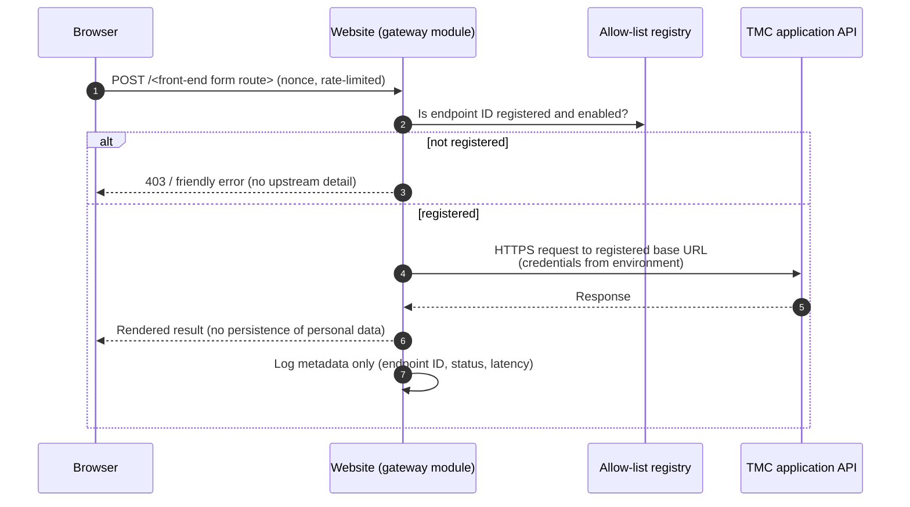

# Integration and Interface Document

| Document ID | Version | Status | RTM references |
|---|---|---|---|
| TMC-WEB-ARC-03 | 0.2 | Draft for TMC IT approval | R-4.15-4, R-4.4-1 to R-4.4-3, R-4.12-1 to R-4.12-5, R-4.10-7 |

This document lists every interface of the website ecosystem: with TMC-developed applications, with
external services, with operators, and between internal components. It is updated at each release
(R-4.15-9).

## 1. Interface principles (SOW §4.4, §4.12)

1. TMC develops, hosts and operates its applications (online forms, patient services, EMR, appointments,
   payments, examinations and results). The project builds **only the front-end presentation layer**
   and connects it to **TMC-approved endpoints**.
2. The project implements **no business logic** of those applications and has **no access to clinical or
   patient data**. Submitted data is passed through and never stored in the website database.
3. **Internal application URLs are never exposed** on the public internet: browsers talk only to the
   website; the website's server-side gateway talks to the approved endpoint.
4. Every integration uses a **standards-based interface** (HTTPS + JSON or form POST) with
   **authentication, rate control and logging** appropriate to its sensitivity.
5. No third-party script, font or tracker is loaded from outside the website at runtime.

## 2. Interface inventory

| ID | Interface | Direction | Protocol | Authentication | Status |
|---|---|---|---|---|---|
| IF-01 | Public web (six sites, EN + HI) | Browser → website | HTTPS | None (public) | In place |
| IF-02 | CMS administration (`/wp-admin`, `/wp-login.php`) | Browser → website | HTTPS | Username + password + TOTP MFA (Two Factor 0.17.0, enforced for privileged roles) from allow-listed networks only | In place (`security-test.php`, `smoke.d/security.sh`) |
| IF-03 | WordPress REST API (`/wp-json/`) used by the block editor | Browser → website | HTTPS + JSON | WordPress cookie + nonce | In place (core) |
| IF-04 | Event calendar download (`/events/<slug>/?ics=1`) | Browser → website | HTTPS, `text/calendar` (RFC 5545) | None | In place |
| IF-05 | XML sitemap (`/wp-sitemap.xml`) and HTML sitemap (`/sitemap/`) | Crawlers/browsers → website | HTTPS | None | In place (core + theme); robots per environment (`seo.php`: indexable only when `WP_ENVIRONMENT_TYPE=production`; `seo-test.php`) |
| IF-06 | Application gateway: TMC application endpoints | Website (server) → TMC API | HTTPS | Per endpoint (API key / mutual TLS / token as TMC specifies); keys only from the environment (`TMC_APP_<SERVICE>_KEY`) | In place: `/wp-json/tmc/v1/apps/<service>/<action>`, registry under *Network Admin → Settings → TMC applications* ([gateway spec](../integration/gateway.md)); tested against the DEMO mock backend |
| IF-07 | Donation payment hand-off | Browser → TMC-approved payment gateway → return URL | HTTPS redirect / form POST | Gateway-specific signature verification | Hand-off built and tested against the DEMO mock gateway ([gateway spec](../integration/gateway.md)); the real gateway and its signature scheme are TMC inputs |
| IF-08 | Location maps | Website → browser | Accessible map block (`tmc/location-map`): text address and directions link always; the OpenStreetMap embed loads only when the visitor asks (CSP allows only that frame origin); no API key | None | In place (`apps-test.php`) |
| IF-09 | Social media | Website → browser | Plain links (per-site Customizer settings) and share links on news/notices, events and tenders (platform share pages, e-mail, "Copy link"); no embedded third-party scripts | None | In place (theme `inc/social.php`); the official account URLs are a TMC input |
| IF-10 | Site search with suggestions (content + documents) | Browser → website | HTTPS; suggestions via `GET /wp-json/tmc/v1/suggest` (rate-limited per IP) | None | In place (`search-test.php`, `smoke.d/search.sh`, E2E keyboard test) |
| IF-11 | Web analytics and search console | Website → TMC-approved analytics | Self-hosted / India-resident option preferred | Per tool | Built: Matomo (cookieless) or GA4 (consent denied by default), off until configured under *Network Admin → Settings → Analytics & Search*; the choice of tool is an EOI query (Q-15) |
| IF-12 | Outbound e-mail (workflow notifications) | Website → SMTP relay | SMTP with TLS | Relay credentials | **Not configured**: needs a TMC-provided relay (EOI query Q-23) |
| IF-13 | Release delivery | GitHub → self-hosted runner → Docker host | HTTPS (runner long-poll) | Runner registration token | In place |
| IF-14 | Backups | Docker host → backup storage in India | TLS | SSH key (`TMC_OFFSITE_SSH_KEY`) and pinned host key | Built: `scripts/backup/offsite-copy.sh` (rsync over SSH, verified after copy), exercised by the CI DR drill; the India-resident target is a TMC input |
| IF-15 | Logs | Docker host → central log store | TLS | Agent credentials | TMC infrastructure: to be connected on the production host to TMC's central log store (180-day retention) |
| IF-16 | Content import (migration) | Operator → WP-CLI importer | CSV/inventory files | Server shell (MFA) | In place: `scripts/import/import-inventory.php` (WP-CLI `eval-file`), dry run, report CSV ([importer guide](../migration/importer.md)); tested by `import-test.php` |

## 3. Application gateway (IF-06)

Implemented by `src/mu-plugins/tmc-core/apps-gateway.php` (route `/wp-json/tmc/v1/apps/<service>/<action>`),
the registry screen *Network Admin → Settings → TMC applications* (`apps-admin.php`) and one API key per
service from the environment (`TMC_APP_<SERVICE>_KEY`). The full specification is
[docs/integration/gateway.md](../integration/gateway.md). The design is:

| Aspect | Requirement |
|---|---|
| Registry | Each endpoint has an ID, base URL, allowed methods and paths, timeout and enabled flag. The browser only ever sends the ID. |
| Credentials | Read from environment variables on the server; never stored in the database or returned to the browser. |
| Rate control | Per client IP and per endpoint, configurable. |
| Logging | Endpoint ID, HTTP status, latency, correlation ID. **No request or response bodies**, no personal data. |
| Persistence | None: no submitted field is written to the website database (tested). |
| Failure | Timeouts and upstream errors produce an accessible message and a support reference; no stack traces or upstream host names. |
| Change control | New endpoints are added only on TMC IT's written request (Change Request procedure) and after firewall rules on both sides are in place. |

### 3.1 Endpoint register (to be completed with TMC)

| Endpoint ID | TMC application | Purpose | Base URL (internal) | Auth method | Data classification | TMC owner | Approved on |
|---|---|---|---|---|---|---|---|
| [TMC TO FILL] | Appointment system | Book / view appointment | [TMC TO FILL] | [TMC TO FILL] | Personal | [TMC TO FILL] | |
| [TMC TO FILL] | Results / examination module | Results lookup | [TMC TO FILL] | [TMC TO FILL] | Personal | [TMC TO FILL] | |
| [TMC TO FILL] | Online forms | Generic submission | [TMC TO FILL] | [TMC TO FILL] | As per form | [TMC TO FILL] | |
| [TMC TO FILL] | Payment gateway | Donation hand-off and verification | [TMC TO FILL] | [TMC TO FILL] | Financial | [TMC TO FILL] | |

The list of TMC applications and screens in scope and their API specifications is requested in EOI
query Q-09.

## 4. Internal interfaces

| Interface | Provider | Consumer | Contract |
|---|---|---|---|
| Field schema `tmc_field_schema()` | `tmc-core/content-types.php` | Meta registration, editor meta boxes, validation, theme views, REST | Keys stored as protected meta `_<key>`; types `text`, `url`, `email`, `number`, `datetime` (site time `Y-m-d H:i:s`), `select`, `documents`, `departments` |
| Field accessor `tmc_field( $post_id, $key )` | `tmc-core` | Theme | Returns value; `departments` returns an array of IDs |
| Lifecycle `tmc_lifecycle( $post_id )` | `tmc-core` | Theme, expiry job | `open`/`closed` (tenders, jobs), `upcoming`/`ongoing`/`past` (events), `current`/`expired` (posts) |
| Audit API `tmc_audit( $action, $args )` | `tmc-core/audit-log.php` | Every module | Adds a chained entry; modules must log security-relevant actions through it |
| Audit verification `tmc_audit_verify()` | `tmc-core` | Admin screen, tests | Returns `ok`, `count`, `broken_at` or `last_hash` |
| Dynamic blocks | Theme `inc/blocks.php` | Editors (block inserter), home sections | `tmc/network`, `tmc/sitemap`, `tmc/notice-board` (`category`, `count`), `tmc/latest-news` (`category`, `count`), `tmc/tenders`, `tmc/jobs`, `tmc/events` (`count`) |
| Migrations | `scripts/migrate.php` | `setup.sh` on every environment | Files `scripts/migrations/NNN-name.php` return `true`; applied names in option `tmc_migrations` |
| Test harness | `scripts/run-tests.sh`, `scripts/smoke-test.sh` | CI, `make check` | `scripts/tests/*-test.php` (WP-CLI `eval-file`, TMH site); `scripts/smoke.d/*.sh` call `check HOST PATH STATUS [text…]` |

## 5. Public URL conventions

| Content | English URL | Hindi URL | Views |
|---|---|---|---|
| Pages | `/<parent>/<page>/` | `/hi/<transliterated-slug>/` | — |
| Tenders & EOIs | `/tenders/` | `/hi/tenders/` | `?view=archive` for closed |
| Careers | `/careers/` | `/hi/careers/` | `?view=archive` for closed |
| Events | `/events/` | `/hi/events/` | `?view=calendar`, `?view=past`; `?ics=1` on an event |
| Departments | `/departments/` | `/hi/departments/` | — |
| Doctors | `/doctors/` | `/hi/doctors/` | `?department=<id>&name=<text>` filter |
| News / notices | `/category/news/`, `/category/notices/` | Hindi category slugs | — |
| Search | `/?s=<terms>` | `/hi/?s=<terms>` | Results include documents (with PDF text); `&type=<content type>` filter; suggestions from `/wp-json/tmc/v1/suggest` |
| Documents | `/documents/` | — (English page only in this release; editors can add the **Documents** block to a Hindi page) | `?doc_type=<type>&doc_year=<year>`, `doc_page` for pagination |
| Sitemap | `/sitemap/` | `/hi/sitemap-hi/` | — |

## 6. Change history

| Version | Date | Change | Author |
|---|---|---|---|
| 0.1 | 29/09/2026 | First draft from repository state | Project team |
| 0.2 | 30/09/2026 | Aligned with the integrated code: robots per environment, share links, search and document URLs, log interface | Project team |
