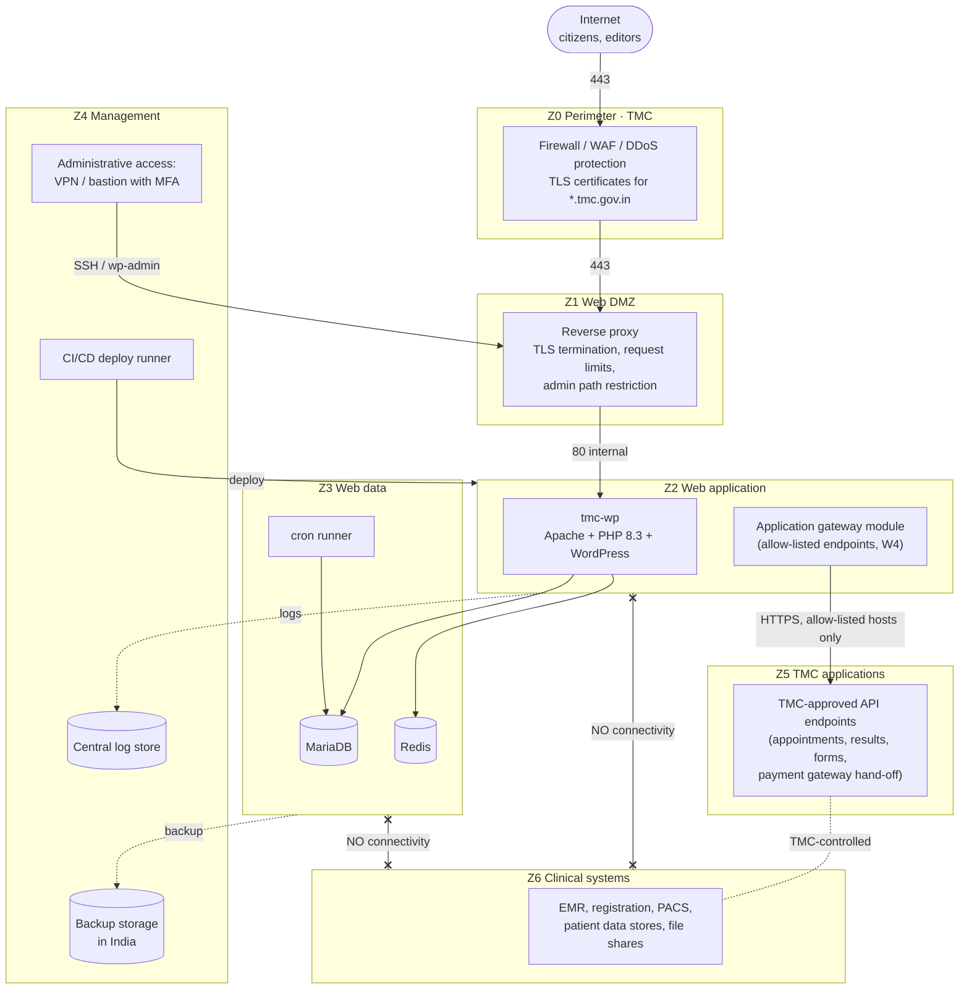

# Security Architecture Document

| Document ID | Version | Status | RTM references |
|---|---|---|---|
| TMC-WEB-ARC-02 | 0.1 | Draft: submitted for TMC approval at Milestone M2; re-validated before each Go-Live | R-4.8-1 to R-4.8-9, R-2-6, R-4.4-3, R-4.12-1/2, R-7-2 |

**Purpose.** SOW §4.8 requires "a security architecture document, describing the segregation approach,
network and data flows, and access controls, submitted for TMC's approval at Milestone M2 and
re-validated before Go-Live". This document is that deliverable. It states the threat the design
addresses, the security zones, the permitted flows, how administrative access is controlled, how
activity is logged, and how keys and secrets are managed.

**Status markers.** Each control is marked **In place** (implemented in this repository and tested),
**In progress** (not yet complete; the gap is stated), or **TMC
infrastructure** (provided by TMC's network, firewall or hosting and configured jointly).

---

## 1. Security objective

> A compromise, defacement or vulnerability in the public website or CMS must not provide any route
> into EMR, patient registration, appointment, payment or other clinical systems (SOW §4.8).

The design principles that follow from this objective:

1. **No clinical data on the website platform.** The website stores public content only. Application
   front ends pass user input to TMC-approved endpoints and do not persist it (R-4.4-3).
2. **No network path to clinical zones.** The website zone has no route to clinical networks,
   databases, patient data stores or internal file shares. The only permitted outbound path to TMC
   applications is the allow-listed application gateway.
3. **Separate everything.** Separate infrastructure accounts, database, database users and secrets from
   clinical systems (R-4.8-2).
4. **Least privilege, strong authentication, full audit.** Role-based authorisation, MFA for
   privileged users, restricted administrative network access, tamper-evident logging.
5. **Defence in depth.** Perimeter firewall/WAF (TMC), reverse proxy, hardened web server, hardened
   application, internal-only data network.

## 2. Security zones

| Zone | Contents | Owner | Inbound allowed | Outbound allowed |
|---|---|---|---|---|
| Z0 Perimeter | Firewall, WAF, DDoS protection, public DNS, TLS certificates | TMC infrastructure | Internet: 443 (80 redirect only) | Z1 only |
| Z1 Web DMZ | Reverse proxy | Project (configured), TMC (hosts) | From Z0: 443; from Z4: admin paths | Z2: HTTP to `tmc-wp` only |
| Z2 Web application | `tmc-wp` container, application gateway module | Project | From Z1 only | Z3 (DB/cache); Z5 allow-listed endpoints only; WordPress.org for updates **only from the build/provisioning step** (see §4.3) |
| Z3 Web data | MariaDB, Redis, cron | Project | From Z2 and the provisioning tool (`wpcli`) only | None (Docker `internal: true`) |
| Z4 Management | VPN/bastion with MFA, deploy runner, backup storage, central logs | TMC (owner), project (operator under TMC control) | Named administrators after MFA | Z1/Z2/Z3 for administration; GitHub for releases |
| Z5 TMC application integration | TMC-developed application APIs | TMC | From Z2 gateway only (allow-list on TMC side too) | TMC-controlled |
| Z6 Clinical | EMR, registration, PACS, patient data | TMC | **Nothing from Z1–Z4** | — |

### 2.1 What is implemented in the container layer (In place)

| Control | Implementation | Evidence |
|---|---|---|
| Data tier has no internet and no host ports | `tmc_internal` network is `internal: true`; `db`, `redis`, `cron` attach only to it; no `ports:` on them | `docker-compose.yml` |
| Only the web container has an outbound network | `tmc_edge` joined by `wordpress` and the on-demand `wpcli` only | `docker-compose.yml` |
| Web container not published on UAT | `compose.server.yml` has no ports; reverse proxy reaches `tmc-wp` over the `homelab` network | `compose.server.yml` |
| Web container published on loopback only in Dev/CI | `127.0.0.1:80:80` | `compose.local.yml` |
| Theme and plugin code read-only at runtime | bind mounts with `:ro`; `DISALLOW_FILE_EDIT` | `docker-compose.yml` |
| No PHP execution in uploads | Apache `DirectoryMatch` denies `.php`, `.phtml`, `.phar`, `.php<n>` | `wordpress/apache-tmc.conf` |
| XML-RPC disabled | `xmlrpc.php` denied (HTTP 403, smoke-tested) | `apache-tmc.conf`, `smoke-test.sh` |
| Version disclosure removed | `ServerTokens Prod`, `ServerSignature Off`, `expose_php = Off`, generator tag removed | `apache-tmc.conf`, `php.ini`, `inc/assets.php` |
| Security headers | `X-Content-Type-Options`, `X-Frame-Options: SAMEORIGIN`, `Referrer-Policy`, `Permissions-Policy` | `apache-tmc.conf` |
| Real client IP behind proxy (for audit log) | `mod_remoteip` trusting private proxy ranges only | `apache-tmc.conf` |
| TRACE disabled | `TraceEnable Off` | `apache-tmc.conf` |

| Content-Security-Policy | Per-request nonce for every script on public pages (`script-src 'self' 'nonce-…'`), `object-src 'none'`, `frame-ancestors 'self'`, `form-action 'self'`; baseline policy on login/admin screens; exact extra origins only through the `tmc_csp_directives` filter (the OpenStreetMap embed for the location map; the analytics origin when configured) | `tmc-core/security-headers.php`, `scripts/smoke.d/security.sh` |
| HSTS | `Strict-Transport-Security` on every HTTPS response (one year; `includeSubDomains` only when `TMC_HSTS_INCLUDE_SUBDOMAINS=1`) | `tmc-core/security-headers.php` |
| Cross-origin isolation headers | `Cross-Origin-Opener-Policy: same-origin`, `Cross-Origin-Resource-Policy: same-site`, `X-Permitted-Cross-Domain-Policies: none`; `Permissions-Policy` switches off unused browser features | `apache-tmc.conf` |
| security.txt | `/.well-known/security.txt` (RFC 9116); the contact is a marked placeholder until TMC confirms it (`TMC_SECURITY_CONTACT`) | `tmc-core/security-headers.php` |

All of the above are **In place** and verified in CI by `scripts/tests/security-test.php` and
`scripts/smoke.d/security.sh`; the full OWASP Top 10 (2021) mapping with evidence is
[docs/security/owasp-top10.md](../security/owasp-top10.md).

## 3. Segregation from clinical systems (R-4.8-1, R-2-6)

| Requirement (SOW §4.8) | Design | Responsibility | Evidence for Go-Live acceptance |
|---|---|---|---|
| Website and CMS in a network zone segregated from clinical systems | Zones Z1–Z4 hosted on infrastructure (VPC/VLAN/subnet) separate from Z6 | TMC infrastructure + project | Network diagram signed by TMC IT; firewall rule export |
| No direct connectivity to clinical systems, databases, patient data stores or internal file shares | Default-deny egress from Z1–Z4 towards TMC internal ranges; the only exception is Z2 → Z5 allow-listed endpoints | TMC firewall; project provides the required rule set | Segregation test (below) |
| Interaction only through approved, controlled, allow-listed endpoints | Application gateway: server-side registry of approved endpoints, unknown endpoints refused, upstream URLs never exposed to browsers (R-4.12-1) | Project (W4) | `scripts/tests/apps-test.php`, `scripts/smoke.d/apps.sh` and the network segregation check (`.github/workflows/apps-gateway.yml`) in every CI run |
| Separate accounts, databases, credentials | Own MariaDB instance and users, own `.env` secrets, own cloud/host accounts | Project + TMC | Credential inventory in handover |

### 3.1 Segregation validation test (performed at M2 and before each Go-Live)

Performed from inside `tmc-wp` and from the Docker host by the Infrastructure/Security Specialist in the
presence of TMC IT; results recorded in the Go-Live acceptance pack.

| # | Test | Command (example) | Expected |
|---|---|---|---|
| S-1 | Database not reachable from outside the data zone | from the host / DMZ: `nc -zv <db-host> 3306` | Connection refused / no route |
| S-2 | Data zone has no internet | `docker compose exec db sh -c 'getent hosts example.org \|\| echo no-dns'` | No DNS resolution / no route |
| S-3 | Web zone cannot reach each clinical range provided by TMC | `docker compose exec wordpress curl -m 5 -sS http://<clinical-ip>/` | Timeout / blocked, for every range on TMC's list |
| S-4 | Web zone can reach only the allow-listed application endpoints | gateway call to an approved endpoint vs. an unapproved one | Approved: success; unapproved: refused by the gateway **and** by the firewall |
| S-5 | No clinical hostnames or internal URLs in public pages | crawl all pages and search for TMC internal host names | None found |
| S-6 | Website database contains no submitted form data from application front ends | after an end-to-end gateway test, search the DB for the test values | None found (R-4.4-3) |

## 4. Network and data flows

### 4.1 Permitted flows

| # | Source | Destination | Protocol/port | Purpose | Control |
|---|---|---|---|---|---|
| F1 | Internet | Perimeter | TCP 443 (80 → redirect) | Public websites and CMS login | WAF, TLS |
| F2 | Perimeter | Reverse proxy | TCP 443/80 | Forward requests | Firewall |
| F3 | Reverse proxy | `tmc-wp` | HTTP 80 (internal network) | Application traffic | Only the proxy can reach `tmc-wp` |
| F4 | `tmc-wp` | `tmc-db` | TCP 3306 on `tmc_internal` | Content | Internal network; DB user limited to the WordPress schema |
| F5 | `tmc-wp` | `tmc-redis` | TCP 6379 on `tmc_internal` | Object cache | Internal network |
| F6 | `tmc-cron` | `tmc-db` | TCP 3306 on `tmc_internal` | Scheduled jobs | Internal network; no internet |
| F7 | `tmc-wp` (gateway) | TMC application endpoints (Z5) | HTTPS 443 | Appointments, results, forms, payment hand-off | Allow-list in code **and** firewall; authentication, rate control, logging (R-4.12-2) |
| F8 | Administrators | Reverse proxy `/wp-admin`, `/wp-login.php`; hosts via SSH | HTTPS, SSH | Administration | VPN/bastion, source allow-list, MFA |
| F9 | Deploy runner | Docker host | Local | Release deployment | Runner registered to the repository; runs only the pipeline |
| F10 | Docker host | Backup storage (India) | TLS | Backups | Encrypted, access-restricted |
| F11 | Docker host | Central log store | TLS (syslog/agent) | Log retention | Append-only store, 180-day minimum |
| F12 | Docker host | NTP servers (NIC/NPL) | UDP 123 | Time synchronisation | Required for log correlation (CERT-In Directions, 28 April 2022) |

### 4.2 Flows that are denied

| Denied flow | Reason |
|---|---|
| Any Z1–Z4 component → clinical zone Z6 | Core segregation requirement |
| Internet → `tmc-db`, `tmc-redis`, `tmc-cron` | Data zone is internal-only |
| Browser → TMC application endpoints directly | Internal URLs must not be exposed (R-4.12-1); the gateway proxies them |
| `tmc-wp` → arbitrary internet hosts at runtime (Production) | No runtime third-party dependencies; outbound limited to allow-listed endpoints |

### 4.3 Software updates

WordPress core, the Polylang plugin and language packs are fetched from WordPress.org during
provisioning (`scripts/setup.sh`). In Production, the recommended arrangement is that updates are
applied **only through the pipeline** after passing CI and UAT (see
[Patch Management](../operations/patch-management.md)), and that Production egress to WordPress.org is
opened only for the duration of the provisioning step or replaced by a TMC-approved mirror.

## 5. Access control (R-4.8-3, R-4.6-2)

### 5.1 CMS roles

| Role (label) | WordPress role | Scope | Can publish | Can manage users | Typical holder |
|---|---|---|---|---|---|
| Super Admin | network super admin | All six sites, network settings, plugins, themes, audit log | Yes | Yes (network) | TMC IT (2 named officers) |
| Site Administrator | `administrator` | One site: settings, menus, users of that site | Yes | Yes (that site) | Unit IT / web coordinator |
| Reviewer / Publisher | `editor` | One site: review, approve, publish, schedule | Yes | No | Department heads' nominees, communications officers |
| Content Editor | `contributor` + `edit_pages`, `edit_others_posts`, `edit_others_pages`, `delete_pages`, `upload_files` | One site: drafts and submission for review | **No** | No | Unit content editors |

The built-in "Author" role is removed because it can publish without review (`roles.php`). Content
Editors lack `publish_*` and `edit_published_*` capabilities and therefore cannot change live content;
this is verified by `scripts/tests/workflow-test.php`, which drives the REST API as each role.

**Centralised TMC-wide publishing** (a TMC Reviewer / Publisher publishes an item once and selects the
unit sites that receive a synced copy) is in place: `tmc-core/network-publishing.php`, verified by
`scripts/tests/editorial-test.php`. Copies keep the original's dates and point their canonical URL
at the original.

### 5.2 Authentication

| Control | Status |
|---|---|
| Unique named accounts; shared accounts prohibited | Policy ([Access Control Policy](access-control-policy.md)) |
| Passwords hashed by WordPress core; strong-password policy | In place: at least 12 characters (`TMC_PASSWORD_MIN_LENGTH`) and three of four character classes for privileged accounts, checked on profile save, reset and sign-in (`security-session.php`) |
| TOTP multi-factor authentication mandatory for Super Admin, Site Administrator and Reviewer / Publisher | In place: Two Factor plugin 0.17.0 (TOTP + backup codes; e-mailed codes switched off), enforced by `security-mfa.php`; until a privileged account enrols, every admin screen redirects to its profile and other REST calls are refused. `TMC_ENFORCE_MFA=0` exists for automated test stacks only and is never set on UAT or production |
| Administrative network restriction (`/wp-admin`, `/wp-login.php` limited to TMC/VPN address ranges) | In place in the application (`TMC_ADMIN_ALLOW_CIDRS`; default private ranges and the VPN range only; HTTP 403 and an audit entry otherwise, `security-network.php`); the reverse proxy / firewall rule is TMC infrastructure |
| Login failure logging | In place: `login_failed` audit event with reason code |
| Login rate limiting / lockout | In place: lockout after 5 failures per account or 20 per IP address within 15 minutes, doubling from 60 seconds up to 1 hour; one generic error message; no user enumeration (`security-login.php`) |
| Session expiry for privileged roles | In place: every signed-in session ends after 30 minutes of inactivity (`TMC_ADMIN_IDLE_MINUTES`); privileged sessions last at most 12 hours per sign-in, even with "Remember me" (`TMC_ADMIN_SESSION_HOURS`) (`security-session.php`) |
| Infrastructure access (SSH, cloud console) with MFA and key-based authentication only | TMC infrastructure; vendor access per [Access Control Policy](access-control-policy.md) |

### 5.3 Infrastructure access

| Access | Who | How | Logged in |
|---|---|---|---|
| Cloud/host console | TMC IT; vendor only when granted | TMC identity provider with MFA | Cloud/host audit trail |
| SSH to Docker hosts | Named administrators | Key-based via VPN/bastion; password login disabled | Bastion/session logs, `auth.log` |
| Database | No interactive access by default | `docker compose exec` from the host, time-bound, ticket-referenced | Host shell history + ticket |
| GitHub repository | TMC (owner) and named project staff | Organisation SSO/2FA; branch protection on `main` | GitHub audit log |
| Deploy runner | Pipeline only | Self-hosted runner bound to this repository | GitHub Actions run history + `.release-history` |

## 6. Audit logging (R-4.8-4, R-4.6-4)

### 6.1 CMS audit log (In place)

`src/mu-plugins/tmc-core/audit-log.php` records every administrative action on all six sites in one
network-wide table (`tmc_tmc_audit_log`).

**Tamper evidence.** Each entry stores `prev_hash` and `hash = HMAC-SHA256(key, prev_hash ‖ fields)`.
Editing, deleting or re-ordering any entry breaks the chain from that entry onwards; *Network Admin →
Audit Log → Verify integrity* recomputes the whole chain and reports the first broken entry. The HMAC key
`TMC_AUDIT_KEY` is held in the environment, not in the database, so a person with database access alone
cannot forge a valid chain. Each entry written during a web request is also copied to the web
container's log as a line beginning `TMC-AUDIT`, giving an independent second record.

**Events recorded:**

| Category | Events |
|---|---|
| Authentication | `login`, `login_failed`, `logout`, `password_reset`, `password_changed` |
| Content | `content_created`, `content_submitted_for_review`, `content_returned_for_changes`, `content_published`, `content_scheduled`, `content_updated` (with changed fields), `content_unpublished`, `content_made_private`, `content_trashed`, `content_restored`, `content_deleted_permanently`, `content_status_changed` |
| Automatic lifecycle | `tender_closed`, `job_opening_closed`, `content_expired` (user `system`) |
| Media | `media_uploaded`, `media_deleted` |
| Users and permissions | `user_created`, `user_deleted`, `user_deleted_from_network`, `user_role_changed`, `user_added_to_site`, `user_removed_from_site`, `user_email_changed`, `super_admin_granted`, `super_admin_revoked` |
| System | `plugin_activated`, `plugin_deactivated`, `theme_switched`, `site_created`, `site_deleted`, `setting_changed`, `network_setting_changed`, `migration_applied` |
| Audit log itself | `audit_log_verified`, `audit_log_exported` |

Fields per entry: time (UTC, displayed in IST), site, user ID and login, client IP (real IP via
`mod_remoteip`; `cli` for command-line), event, object type/ID/title, details (JSON), previous hash,
hash. Retention and review are governed by the [Audit Log Retention Policy](audit-log-retention-policy.md).

### 6.2 Other log sources

| Source | Content | Retention target |
|---|---|---|
| Web container log (`docker logs tmc-wp`) | Apache access/error logs, PHP errors, `TMC-AUDIT` copies | Shipped to central log store; 180 days minimum |
| Reverse proxy / WAF | Requests, blocks | 180 days minimum (TMC infrastructure) |
| Host (`auth.log`, Docker daemon) | Logins, privilege use, container events | 180 days minimum |
| GitHub | Commits, pull requests, pipeline runs, deployments | Life of repository |
| Server release record | `.release-history`: commit, time, actor, run ID | Life of server |

The 180-day minimum follows the CERT-In Directions under section 70B(6) of the Information Technology
Act, 2000 (28 April 2022), which require logs of ICT systems to be maintained for a rolling 180 days
within Indian jurisdiction. TMC may specify a longer period.

## 7. Application security controls

| OWASP Top 10 (2021) risk | Principal controls in this code base | Status |
|---|---|---|
| A01 Broken access control | Capability checks on every write; roles restricted; REST permission checks exercised per role in `workflow-test.php`; nonces | In place; extended by W2 |
| A02 Cryptographic failures | TLS at perimeter; HMAC-SHA256 audit chain; WordPress password hashing; secrets outside the DB | In place / TMC infrastructure (TLS) |
| A03 Injection | `$wpdb->prepare` for all queries with input; output escaping (`esc_html`, `esc_attr`, `esc_url`, `wp_kses_post`); CSV-formula neutralisation in the audit export | In place |
| A04 Insecure design | Segregation by zone; no clinical data; review workflow; threat-led design (this document) | In place |
| A05 Security misconfiguration | Hardened Apache/PHP, file editing disabled, XML-RPC denied, uploads non-executable, reproducible provisioning | In place; CSP/HSTS in W2 |
| A06 Vulnerable and outdated components | Pinned versions; patch SLA of 30 days; image and dependency scanning in CI (W2) | Partly in place |
| A07 Identification and authentication failures | MFA, rate limiting, session policy (W2); failed-login logging | In place (`security-test.php`) |
| A08 Software and data integrity failures | All releases from Git through CI; no plugin/theme installation from the admin UI in Production; tamper-evident audit log | In place |
| A09 Security logging and monitoring failures | Audit log + container logs + central retention; monitoring (W7) | Partly in place |
| A10 Server-side request forgery | Gateway accepts only registered endpoints; no user-supplied upstream URLs (W4) | In place (`apps-test.php`) |

The full OWASP mapping with test evidence is [docs/security/owasp-top10.md](../security/owasp-top10.md);
the pre-VAPT readiness checklist is [docs/security/pre-vapt-checklist.md](../security/pre-vapt-checklist.md).

## 8. Key and secret management

| Secret | Purpose | Generated by | Stored | Rotation |
|---|---|---|---|---|
| `DB_PASSWORD` | WordPress DB user | `scripts/make-env.sh` (32 random alphanumerics via `openssl rand`) | `.env` on the host, mode 600 | Annually, on staff change, or on suspicion; procedure in the [System and Security Administration Manual](../manuals/system-security-administration-manual.md#6-rotating-secrets) |
| `DB_ROOT_PASSWORD` | MariaDB root (initialisation, emergency) | `make-env.sh` | `.env`, mode 600 | As above |
| `WP_ADMIN_PASSWORD` | First Super Admin (bootstrap only) | `make-env.sh` | `.env` | Change at first login; account then managed in the CMS |
| `TMC_AUDIT_KEY` | HMAC key of the audit chain | `make-env.sh` (48 characters) | `.env`; **escrow copy held by TMC IT offline** | Rotation starts a new chain segment (see policy); never delete an old key while entries signed with it are retained |
| WordPress salts (`AUTH_KEY` etc.) | Cookies and nonces | Generated by the WordPress image at first start (in `wp-config.php` in volume `wp_html`) | `wp_html` volume | Rotating logs everyone out; do after an incident |
| TLS private keys | HTTPS | TMC / certificate authority | Perimeter or reverse proxy | Per certificate validity |
| MFA secrets | TOTP | Users at enrolment (Two Factor plugin) | Database (user meta of the network's users table); backup codes stored hashed | On device loss: an administrator resets the user's second factor |
| CI/CD secrets | Deployment | Not needed today: the self-hosted runner reads the server `.env` in place | — | — |

Rules: secrets are never committed (`.gitignore` excludes `.env`, `.env.*`, `demo-users.txt`,
backups); secrets are read from the environment (`getenv`) and never stored in the database; live
credentials are handed over to TMC separately and securely (SOW §8.2), never inside documents.

## 9. Secure development and release (R-4.8-5)

1. Every change is made on a branch and merged by pull request; `main` is protected.
2. CI builds all six sites from scratch and runs lint, PHP test suites and HTTP smoke tests.
3. The CI security gate (`.github/workflows/security.yml`, required by the deploy job) adds: gitleaks
   secret scanning of the whole Git history, Trivy scanning of the WordPress image (the gate fails on
   any Critical vulnerability that has a fix; the full High/Critical report is kept as an artifact),
   and an OWASP ZAP baseline against a freshly built stack (fails on the rules marked FAIL in
   `security/zap-baseline.conf`). Accepted findings are recorded with a justification and review date.
4. UAT deployment is automatic after every gate passes on `main`; Production promotion is a `vX.Y.Z`
   tag on a commit that passed the Pipeline on `main`, re-tested and approved by a required reviewer
   (`.github/workflows/release.yml`, [environments](../operations/environments.md)).
5. Vulnerability assessment before promotion to production: the CI gate on every release plus the
   CERT-In empanelled VAPT before each Go-Live and annually (R-4.8-7).

## 10. Certification plan (R-4.8-7)

| Certification | When | Scope | Prerequisites prepared by the project |
|---|---|---|---|
| VAPT by a CERT-In empanelled agency | Before M4 Go-Live (TMC + pilot unit), before M5 Go-Live (remaining units), annually in AMC | All six websites, CMS, hosting configuration | Internal pre-assessment report (W2), this document, asset list, test accounts per role |
| Safe-to-Host certificate | Before each Go-Live; renewed as required | Websites as deployed | Closed VAPT report |
| STQC certification | Initiated after M4; obtained by M6; re-certification every three years or as the standard requires | Website ecosystem | Accessibility (WCAG 2.2 AA / GIGW 3.0) and quality evidence from W6 |

Observations from VAPT, STQC or TMC's own review are closed at no cost to TMC following the
[Security Observation Remediation Procedure](../operations/security-observation-remediation.md) (R-4.8-9).

## 11. Re-validation before Go-Live

Before each Go-Live the Infrastructure/Security Specialist re-validates this document against the
deployed system and records the result:

| # | Check | Result | Evidence reference |
|---|---|---|---|
| 1 | Zones and flows in §2 and §4 match the deployed network (firewall export reviewed) | | |
| 2 | Segregation tests S-1 to S-6 passed | | |
| 3 | MFA enforced for every privileged account (list reviewed) | | |
| 4 | Administrative paths reachable only from permitted ranges | | |
| 5 | Audit log integrity verified; retention configuration confirmed | | |
| 6 | Secrets inventory reviewed; no default or demo accounts remain (`demo-users.txt` accounts deleted) | | |
| 7 | CI security gate green for the release being promoted | | |
| 8 | VAPT observations closed; Safe-to-Host obtained | | |

Signed: Infrastructure/Security Specialist [BIDDER TO FILL] — Accepted: TMC IT [TMC TO FILL] — Date: [ ]
