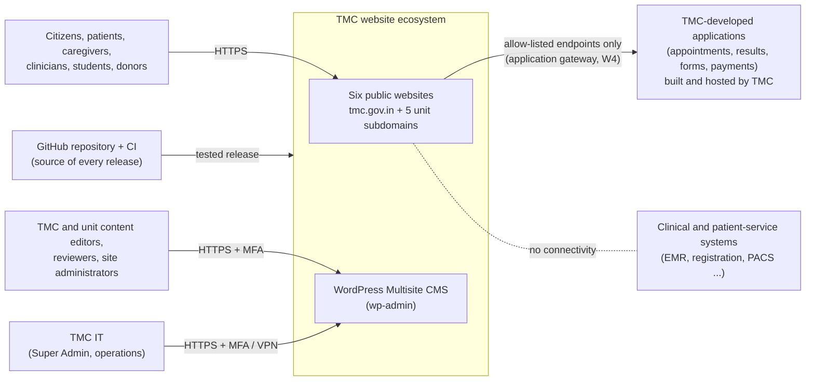
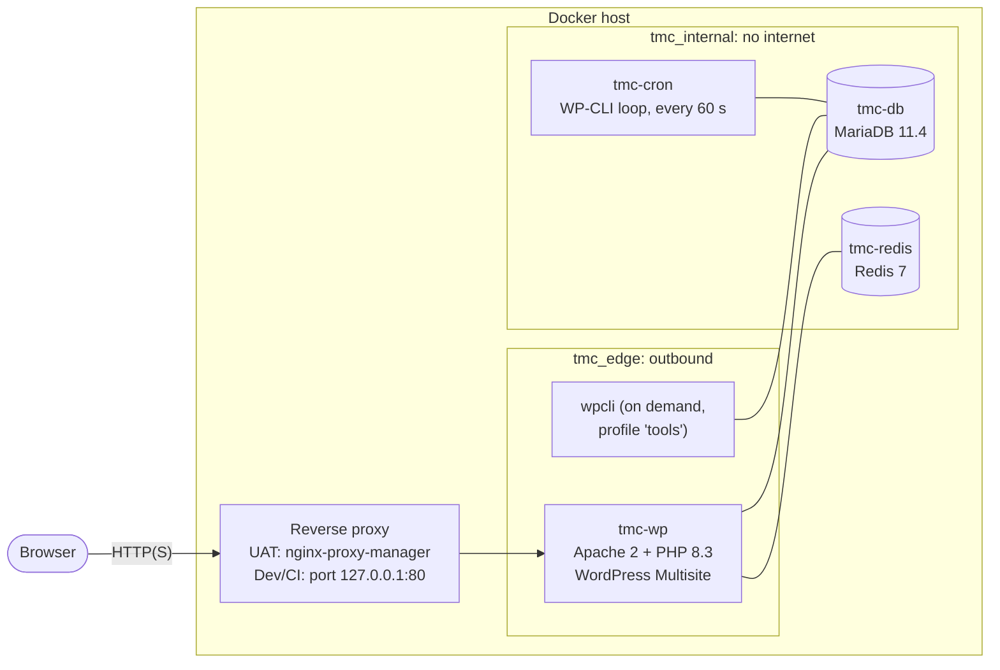
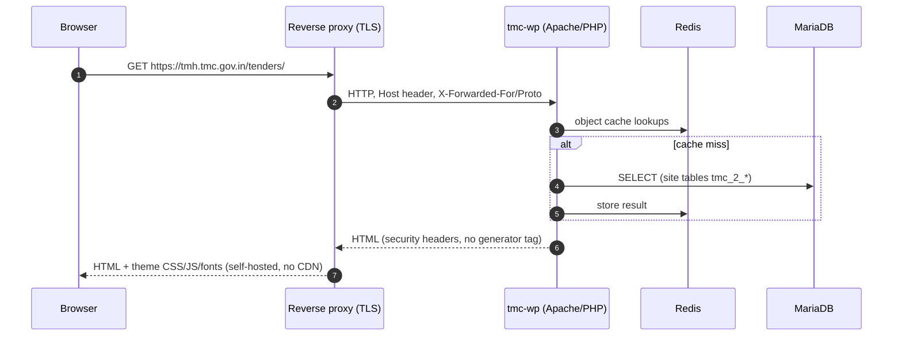
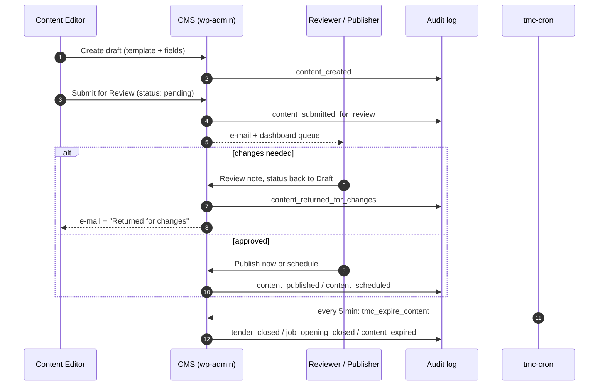
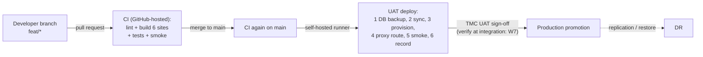

# System Architecture Document

| Document ID | Version | Status | RTM references |
|---|---|---|---|
| TMC-WEB-ARC-01 | 0.1 | Draft for TMC IT review | R-4.15-1, R-4.7-1 to R-4.7-9, R-2-10, R-4.1-\*, R-8.2-6 |

**Project:** Development, CMS Implementation, Deployment, Content Migration, Security Certification,
Training, Warranty and Maintenance of the TMC Website Ecosystem (EOI No. TMH/TMH/2026-27/CAP/EO/0009).

**Scope of this document:** the logical and physical architecture of the website ecosystem as
implemented in this repository: components, containers, networks, data flows, environments and
scaling. The security view (zones, segregation, access control, MFA, logging and key management) is in
the companion [Security Architecture Document](security-architecture.md) (TMC-WEB-ARC-02), which is the
Milestone M2 deliverable required by SOW §4.8.

**Conventions:** "**Verify at integration**" marks a detail (route, variable name, container name) that
belongs to a work stream being built in parallel and is confirmed when the work streams are merged. Every
other statement is taken from the code in this repository.

---

## 1. Architecture summary

| Aspect | Decision | Where in the repository |
|---|---|---|
| CMS | WordPress Multisite (subdomain install): one CMS, one database, one codebase, six websites | `docker-compose.yml` (`WORDPRESS_CONFIG_EXTRA`), `scripts/install-network.sh` |
| Runtime | PHP 8.3 on Apache (official `wordpress:php8.3-apache` image) with phpredis | `wordpress/Dockerfile` |
| Database | MariaDB 11.4, `utf8mb4`, one schema for the network, table prefix `tmc_` | `docker-compose.yml` service `db` |
| Object cache | Redis 7 (in-memory only, no persistence, 256 MB LRU) | `docker-compose.yml` service `redis` |
| Scheduled jobs | A dedicated `cron` container runs due WP-Cron events on every site each minute; page-hit WP-Cron is disabled | `docker-compose.yml` service `cron`, `DISABLE_WP_CRON` |
| Multilingual | Polylang 3.8.10 (GPL), English (default, `en_GB`) and Hindi (`hi_IN`) under `/hi/` | `scripts/setup.sh`, `scripts/setup-languages.php` |
| Presentation | Custom GPL theme `tmc`: design tokens in `theme.json`, server-rendered dynamic blocks, locked (`contentOnly`) section patterns | `src/themes/tmc/` |
| Business rules | Must-use plugin `tmc-core`: roles, review workflow, audit log, content types, fields, automatic expiry | `src/mu-plugins/tmc-core/` |
| Provisioning | Idempotent scripts: the same commands build Dev, CI and UAT from nothing | `scripts/setup.sh`, `scripts/migrate.php`, `scripts/seed-*.php` |
| Delivery | GitHub Actions pipeline: lint → integration test (all six sites) → deploy (UAT) with backup, smoke test and release record | `.github/workflows/pipeline.yml`, `scripts/deploy.sh` |
| Data changes | Versioned, run-once migrations per site (`scripts/migrations/NNN-*.php`) recorded in option `tmc_migrations` | `scripts/migrate.php` |

The platform contains **no proprietary component**. Every component is GPL- or OSI-licensed; see
[THIRD-PARTY-LICENSES.md](../THIRD-PARTY-LICENSES.md) (generated by `scripts/licenses.sh`).

## 2. Context

The public websites never connect to clinical systems. Where a TMC application must be reached (for
example appointment booking or results lookup), the interaction passes only through the TMC-approved,
allow-listed endpoints of the application gateway (SOW §4.4, §4.8, §4.12); see
[Integration and Interface Document](integration-interfaces.md).

## 3. Websites in scope

| # | Website | Site slug | Production host (indicative, SOW §4.1) | UAT host (current) |
|---|---|---|---|---|
| 1 | Tata Memorial Centre (umbrella) | *(main site)* | `tmc.gov.in` | `tmc.100-79-142-44.sslip.io` |
| 2 | Tata Memorial Hospital, Mumbai | `tmh` | `tmh.tmc.gov.in` | `tmh.tmc.100-79-142-44.sslip.io` |
| 3 | HBCH & RC, Visakhapatnam | `hbchrcv` | `hbchrcv.tmc.gov.in` | `hbchrcv.tmc.100-79-142-44.sslip.io` |
| 4 | MPMMCC & HBCH, Varanasi | `mpmmcc` | `mpmmcc.tmc.gov.in` | `mpmmcc.tmc.100-79-142-44.sslip.io` |
| 5 | HBCH & RC, Muzaffarpur | `hbchrcmzp` | `hbchrcmzp.tmc.gov.in` | `hbchrcmzp.tmc.100-79-142-44.sslip.io` |
| 6 | HBCH, New Chandigarh | `hbchpunjab` | `hbchpunjab.tmc.gov.in` | `hbchpunjab.tmc.100-79-142-44.sslip.io` |

The base domain is a single variable, `TMC_BASE_DOMAIN` in `.env`; the unit sites are
`<slug>.<TMC_BASE_DOMAIN>`. Final subdomain names are confirmed by TMC at contract award (SOW §4.1).
Adding a unit website is a documented procedure that needs no code change (see the
[CMS Administrator Manual](../manuals/cms-administrator-manual.md#8-adding-a-new-unit-website), R-2-10).

## 4. Logical architecture

```mermaid
flowchart TB
    subgraph presentation["Presentation: theme tmc"]
        tokens["theme.json design tokens<br/>(colours, type, spacing)"]
        templates["Templates: page, single, archive-*,<br/>single-*, search, 404"]
        blocks["Dynamic blocks: tmc/network, sitemap,<br/>notice-board, latest-news, tenders, jobs, events"]
        patterns["Locked home sections<br/>(templateLock: contentOnly)"]
        a11y["Accessibility bar: text size,<br/>contrast, skip link, keyboard mega-menu"]
    end
    subgraph core["Business rules: plugin tmc-core"]
        roles["roles.php<br/>editorial roles"]
        workflow["workflow.php<br/>review queue, notes, notifications"]
        audit["audit-log.php<br/>HMAC-chained audit log"]
        types["content-types.php + content-fields.php<br/>tenders, events, careers, departments, doctors"]
        expiry["expiry.php<br/>automatic closure / expiry"]
        more["Further modules from parallel work streams:<br/>search, security/MFA, SEO/redirects, gateway,<br/>templates, backup (verify at integration)"]
    end
    subgraph platform["WordPress Multisite + Polylang"]
        wpcore["WordPress core<br/>(posts, revisions, users, media, REST)"]
        pll["Polylang: EN + HI"]
    end
    subgraph data["Data"]
        db[("MariaDB<br/>network schema, prefix tmc_")]
        cache[("Redis<br/>object cache")]
        uploads[("wp_html volume<br/>core files + uploads")]
    end
    presentation --> core --> platform --> data
```

### 4.1 Components in the repository

| Component | Path | Responsibility |
|---|---|---|
| Module loader | `src/mu-plugins/tmc-core.php` | Loads every file in `tmc-core/` (sorted); a feature is a new file, not an edit to a list |
| Roles | `tmc-core/roles.php` | Relabels built-in roles (Site Administrator, Reviewer / Publisher, Content Editor), removes "Author", gives Content Editors draft-only rights on pages and media |
| Review workflow | `tmc-core/workflow.php` | "Awaiting your review" queue, "My submissions" panel, admin-bar counter, review notes, e-mail notifications on submit / return / approval |
| Audit log | `tmc-core/audit-log.php` | Network-wide table `tmc_tmc_audit_log`; HMAC-SHA256 chain; *Network Admin → Audit Log* with filters, integrity verification and CSV export |
| Content types | `tmc-core/content-types.php` | `tmc_tender`, `tmc_event`, `tmc_job`, `tmc_department`, `tmc_doctor`; field schema; lifecycle (`open/closed`, `upcoming/ongoing/past`, `current/expired`) |
| Structured fields | `tmc-core/content-fields.php`, `tmc-core/admin/fields.js` | "Details" meta box per type, validation warnings for missing required fields, documents picker |
| Automatic expiry | `tmc-core/expiry.php` | Every 5 minutes: records closure/expiry of time-bound content once in the audit log |
| Theme bootstrap | `src/themes/tmc/functions.php` | Loads every file in `inc/`; feature CSS/JS in `assets/*/features/` load automatically |
| Views | `src/themes/tmc/inc/content-views.php` and templates | Listings with current/archive views, event calendar, `.ics` download, doctor filter |
| Provisioning | `scripts/setup.sh` and helpers | Containers, network install, pinned plugin, languages, theme, per-site seed and migrations |
| Tests | `scripts/tests/*-test.php`, `scripts/smoke-test.sh`, `scripts/smoke.d/*.sh`, `scripts/lint.sh` | Run locally (`make check`) and in CI |

## 5. Physical (container) architecture

| Service | Image | Networks | Host ports | Persistent data | Notes |
|---|---|---|---|---|---|
| `db` (`tmc-db`) | `mariadb:11.4` | `tmc_internal` | none | volume `db_data` | Health-checked; `max-allowed-packet=64M` |
| `redis` (`tmc-redis`) | `redis:7-alpine` | `tmc_internal` | none | none (`--save ""`) | Cache only; losing it loses no data |
| `wordpress` (`tmc-wp`) | `tmc-wordpress:latest` built from `wordpress/Dockerfile` (base `wordpress:php8.3-apache`) | `tmc_internal`, `tmc_edge` (+ `homelab` on UAT) | Dev/CI: `127.0.0.1:80`; UAT: none | volume `wp_html` (core + uploads); theme and mu-plugins bind-mounted **read-only** | Hardened Apache/PHP config (`wordpress/apache-tmc.conf`, `php.ini`) |
| `cron` (`tmc-cron`) | `wordpress:cli-php8.3` | `tmc_internal` only | none | shares `wp_html` | Runs `wp cron event run --due-now` for each site every 60 seconds |
| `wpcli` | `wordpress:cli-php8.3` | `tmc_internal`, `tmc_edge` | none | shares `wp_html`; `scripts/` mounted read-only at `/tmc-scripts` | Not running; started only for provisioning, migrations and tests |

The environment-specific override file is selected by `COMPOSE_FILE` in `.env`:

| Override | Used by | Effect |
|---|---|---|
| `compose.local.yml` | Developer machine, CI | Publishes WordPress on `127.0.0.1:80` only (loopback) |
| `compose.server.yml` | UAT server | No published port; joins the external `homelab` network so the reverse proxy can reach `tmc-wp` |

**Verify at integration:** the Production and DR overrides, page cache and the backup/monitoring
containers are delivered by work stream W7 (performance, backup/DR, environments and monitoring).

## 6. Data flows

### 6.1 Public page request

All assets (CSS, JavaScript, fonts, images) are served from the site itself; there are no external
CDNs or third-party scripts at runtime (Engineering Conventions, principle 2).

### 6.2 Editorial flow (create → review → publish → expire)

### 6.3 Release flow

Every deployment is tested first, preceded by a database backup, smoke-tested after, and recorded in
`.release-history` on the server (commit, time, actor, run ID). A rollback is a normal deployment of an
earlier commit or tag through *Actions → Pipeline → Run workflow* (R-4.7-4).

## 7. Environments

| Environment | Purpose | Where | How it is built | Access | Data |
|---|---|---|---|---|---|
| **Development** | Build and debug | Developer workstation (Docker Desktop) | `make setup` (`make-env.sh local` + `setup.sh`) | Developer only, loopback `http://tmc.localhost` | Seeded sample data only |
| **CI** | Automated verification of every change | GitHub-hosted `ubuntu-latest`, discarded after each run | `make-env.sh ci` + `setup.sh` + tests + smoke | GitHub Actions logs | Seeded sample data only |
| **UAT** | TMC acceptance testing, demonstrations | UAT server (currently the vendor-managed host "hetser", reachable only over the Tailscale private network) | `deploy.sh` via self-hosted runner on push to `main` | TMC testers and project team | Seeded sample data + TMC test content |
| **Production** | Live websites | TMC-owned or TMC-subscribed infrastructure, MeitY-empanelled cloud in TMC's name where cloud is used (SOW §4.7) | Same scripts; promotion after UAT sign-off | Public (websites); MFA + restricted network (administration) | Live content |
| **Disaster Recovery** | Continuity: RPO 15 min, RTO 1 h | Separate TMC-owned site/region in India | Same scripts + restore of the latest backup set | As Production | Replica / backups of Production |

Production and DR provisioning, the 15-minute backup schedule and the timed restore drill are delivered
by work stream W7. **Verify at integration:** Production/DR compose overrides, promotion workflow and
backup schedule names; see [Backup and Restoration Procedures](../operations/backup-restore.md).

### 7.1 Environment parity

The same repository commit produces every environment. What differs is only `.env`
(see [Configuration Reference](../operations/configuration-reference.md)):

| Setting | Dev | CI | UAT | Production (proposed) |
|---|---|---|---|---|
| `TMC_ENV` | `local` | `ci` | `server` | `production` (verify at integration) |
| `COMPOSE_FILE` | base + `compose.local.yml` | base + `compose.local.yml` | base + `compose.server.yml` | base + production override (W7) |
| `TMC_BASE_DOMAIN` | `tmc.localhost` | `tmc.localhost` | `tmc.100-79-142-44.sslip.io` | `tmc.gov.in` (confirmed at award) |
| Search-engine visibility (`blog_public`) | off | off | off | on (W3: robots per environment) |
| Secrets | generated per machine | generated per run | generated once on the server | generated on TMC infrastructure, held by TMC |

## 8. Hosting requirements (SOW §4.7)

| Requirement | How the architecture meets it |
|---|---|
| TMC-owned or TMC-subscribed infrastructure; MeitY-empanelled cloud in TMC's name | The stack is host-agnostic (Docker Compose on any Linux host). No component requires a vendor account or vendor-hosted service. |
| All data, logs and backups in India, no cross-border processing | No runtime call to external services; fonts and scripts are self-hosted; backups are written to storage designated by TMC. See the [Data Residency Compliance Statement](data-residency-statement.md). |
| Separate Dev, UAT, Production, DR | Section 7. |
| Controlled, auditable promotion, version control, rollback | Git history + pipeline + pre-deploy backup + `.release-history` + redeploy of any earlier commit. |
| Production/DR owned by TMC; vendor access limited and logged | [Access Control and Vendor Access Policy](access-control-policy.md). |
| RPO 15 minutes, RTO 1 hour, periodic drills | W7 backup schedule and timed restore drill; procedure in [Backup and Restoration](../operations/backup-restore.md). |
| Single CMS and security framework for all subdomains | One WordPress Multisite network; one `tmc-core` plugin; one theme. |
| Scheduled backup of content, databases, configurations; tested restore | Section 9 and the backup procedure. |
| Peak load; scale for more units, languages, modules | Section 10. |

### 8.1 Indicative Production sizing

Final sizing is agreed with TMC once the peak traffic figure is provided (EOI query Q-07). The
following is the starting point for the Production and DR hosts, each:

| Resource | Starting size | Basis |
|---|---|---|
| vCPU | 4 | PHP workers for six sites; MariaDB and Redis on the same host |
| Memory | 8 GB | Redis 256 MB, MariaDB buffer pool 2 GB, PHP-FPM/Apache workers at 256 MB limit |
| Disk | 100 GB SSD (data) + backup storage sized for the retention period | Uploads grow with documents; the database is small |
| OS | A supported long-term-support Linux distribution with Docker Engine and the Compose plugin | Security patches per [Patch Management](../operations/patch-management.md) |

## 9. What is persistent and must be backed up

| Item | Location | Contents |
|---|---|---|
| Database | volume `db_data` | All sites' content, users, settings, revisions, audit log |
| Uploads and WordPress core | volume `wp_html` (`wp-content/uploads/sites/<id>/...`) | Media and documents; core files (reproducible) |
| Configuration and secrets | `.env` on each host (mode 600, never in Git) | Database credentials, admin bootstrap, `TMC_AUDIT_KEY` |
| Code and provisioning | Git repository | Everything else; any environment is rebuilt from it |
| Release record | `.release-history`, `.deployed` on the server | Which commit was deployed when and by whom |

`TMC_AUDIT_KEY` must be backed up separately from the database backups (see
[Security Architecture](security-architecture.md#8-key-and-secret-management)): without it the
integrity of the restored audit log cannot be verified.

## 10. Scalability and extensibility

| Growth dimension | Mechanism | Code change needed |
|---|---|---|
| Additional unit website | `wp site create` + the per-site steps of `setup.sh` (seed, languages, migrations) | Only the site list in `install-network.sh` / `setup.sh` / `seed-site-structure.php` so fresh installs include it |
| Additional language (3rd, 4th) | Polylang: add the language on each site; theme strings are wrapped in `__( '…', 'tmc' )` | None in templates (R-4.13-2); translation files only |
| New content type or feature | New file in `tmc-core/` or `inc/`; migration for existing sites | Additive; no edits to existing modules |
| Traffic | 1) Redis object cache (in place); 2) page cache (W7); 3) vertical scaling; 4) horizontal: several `wordpress` containers behind a load balancer with shared uploads storage and the existing external Redis/MariaDB | Configuration only |
| Database | MariaDB tuning; primary/replica for DR (W7) | None |

## 11. Design constraints carried into the architecture

1. **Design is supplied by TMC** (SOW §3). Colours, typography and spacing are tokens in `theme.json`;
   editors cannot pick custom colours, sizes or fonts (`custom: false`), so Annexure A replaces the tokens
   without template rewrites. Deviations are recorded in the
   [Design Deviation Register](../governance/design-deviation-register.md).
2. **No clinical or patient data** is stored on the website platform (SOW §4.4). Application front ends
   pass data through to TMC-approved endpoints without persisting it (W4, verify at integration).
3. **No vendor branding, promotional links or advertisements** (SOW §13). The WordPress generator tag
   is removed; the theme has no credits.
4. **Reproducibility**: servers are never changed by hand. Data changes ship as migrations; settings ship
   as provisioning code.

## 12. Related documents

- [Security Architecture Document](security-architecture.md) (TMC-WEB-ARC-02)
- [Integration and Interface Document](integration-interfaces.md) (TMC-WEB-ARC-03)
- [Data Model and Database Schema Reference](data-model.md) (TMC-WEB-ARC-04)
- [Installation and Deployment Guide](../operations/installation-deployment.md) (TMC-WEB-OPS-01)
- [Configuration Reference](../operations/configuration-reference.md) (TMC-WEB-OPS-02)
- [Backup and Restoration Procedures](../operations/backup-restore.md) (TMC-WEB-OPS-03)
