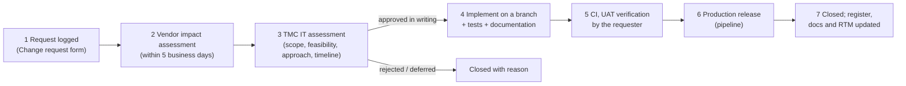

# Change Request Procedure

| Document ID | Version | Status | RTM references |
|---|---|---|---|
| TMC-WEB-GOV-04 | 0.1 | Draft for TMC IT approval | R-14-3, R-5-1, R-6-2 |

## 1. Basis

SOW §14: "This is a fixed-scope engagement. Any proposed change within the agreed scope shall follow a
written Change Request process, under which TMC IT shall assess the change in terms of scope, technical
feasibility, implementation approach, and impact on timelines. No change shall be implemented without
prior written approval of TMC IT."
SOW §5: design deviations only "where such deviation is agreed in writing by TMC IT in advance".

## 2. What needs a Change Request

| Needs a Change Request | Does not |
|---|---|
| New or changed page template, component, content type, field, integration or website | Defect fixes (behaviour differs from what was agreed) |
| Any deviation from Annexures A–C (typography, spacing, colour, layout, component behaviour) | Content changes made by editors in the CMS |
| Change to the security architecture, hosting or environments | Security patches within the [Patch Management](../operations/patch-management.md) procedure |
| Change of a milestone date or deliverable | Configuration an administrator performs in the CMS (users, menus, contact details) |
| AMC minor enhancements (tracked against the allowance) | Documentation corrections |

## 3. Process

1. **Request.** Anyone (TMC IT, a unit via its coordinator, or the Vendor) logs the request with the
   **Change request** form (`.github/ISSUE_TEMPLATE/change-request.yml`), or on the paper form in §5 where
   the tracker is not used.
2. **Impact assessment by the Vendor** within 5 business days: scope; technical feasibility;
   implementation approach; effort (person-days); impact on milestones and on other work; impact on
   security architecture, accessibility, performance, data residency; documentation and training impact;
   cost implication (stated in a separate letter to TMC IT when commercial).
3. **Assessment and decision by TMC IT** (SOW §14). Changes affecting a milestone date or contract value
   are referred to the Project Steering Committee. The decision is recorded in writing (signed form or
   e-mail from the authorised TMC IT officer), referenced in the ticket.
4. **Implementation** only after written approval, on a branch referencing the CR number, with tests.
5. **Verification** in UAT by the requester.
6. **Release** through the pipeline (never by hand on a server).
7. **Closure**: CR register, documentation, RTM and, for design changes, the
   [Design Deviation Register](design-deviation-register.md) updated.

**Emergency changes** (to restore service or close an exploited vulnerability) follow the
[Incident and Support Model](../operations/incident-support-model.md) with verbal TMC IT approval
recorded in the ticket; the CR paperwork is completed within one business day.

## 4. Change Request register

| CR No. | Date | Title | Requested by | Category | Effort (p-d) | Timeline impact | Decision (date, ref.) | Released (tag) | Status |
|---|---|---|---|---|---|---|---|---|---|
| CR-001 | | | | | | | | | |

## 5. Change Request form (paper / e-mail version)

| Field | Entry |
|---|---|
| CR number | CR-[ ] |
| Title | |
| Requested by (name, designation, unit) and date | |
| Category | Functional / Design deviation / Integration / Infrastructure-security / Schedule / Documentation-training / Minor enhancement |
| Description and reason | |
| References (SOW clause, RTM ID, Annexure/Figma frame, tickets) | |
| **Vendor impact assessment** | |
| Scope affected (websites, templates, modules) | |
| Technical feasibility and approach | |
| Effort (person-days) and schedule | |
| Impact on milestones | |
| Impact on security, accessibility, performance, data residency | |
| Documentation and training impact | |
| Risks | |
| Prepared by (Vendor Project Lead), date | |
| **Decision (TMC IT)** | Approved / Approved with conditions / Rejected / Deferred |
| Conditions | |
| Authorised signatory (TMC IT), date | |
