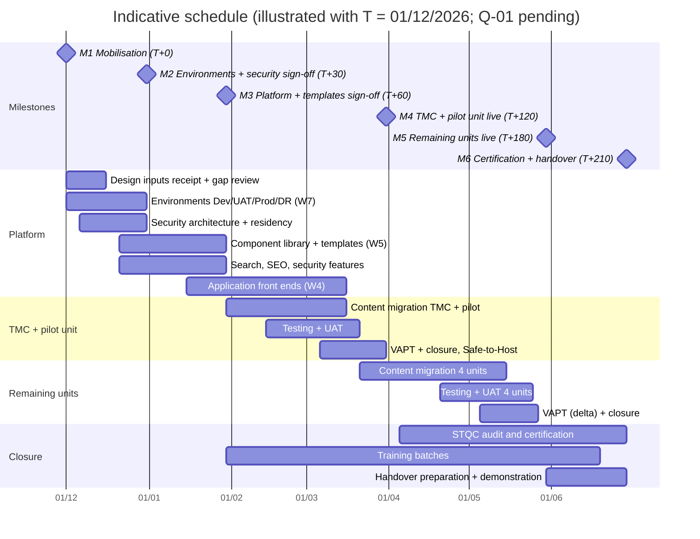

# Execution Plan (Milestones M1–M6)

| Document ID | Version | Status | RTM references |
|---|---|---|---|
| TMC-WEB-GOV-01 | 0.1 | Draft; part of the Technical Bid (SOW §12.1) and of the project management plan at M1 | R-7-1, R-7-2, R-7-3, R-7.1-1, R-11-\*, R-12.1-\* |

## 1. Basis

SOW §7 sets six milestones with payment stages and indicative timelines from Contract Award (T):

| Milestone | Indicative timeline | Payment |
|---|---|---|
| M1 Contract Award and Mobilisation | T + 0 days | 10 % |
| M2 Environment, Architecture and Security Sign-off | T + 30 days | 15 % |
| M3 Core Platform and Template Build | T + 60 days | 20 % |
| M4 TMC Website and Pilot Unit Website Go-Live | T + 120 days | 20 % |
| M5 Remaining Unit Websites Go-Live | T + 180 days | 20 % |
| M6 Certification, Training, Handover and Project Closure | T + 210 days | 15 % |

SOW §7 also states an "indicative total project duration of 150 days", while M6 falls at T + 210 days.
This plan follows the milestone table (T + 210) until TMC clarifies (EOI query Q-01). The timelines "may
be revised by TMC having regard to the readiness of design and content inputs, the progress of
approvals, certification and audit schedules"; the dependencies on TMC inputs are listed in §5.

## 2. Approach

1. **Platform first, then sites.** The CMS, security framework, component library and templates are
   built once (M2–M3) and reused by all six websites (SOW §4.1: remaining units "substantially similar …
   lower incremental development effort").
2. **Everything as code.** Every environment is built from this repository by the same scripts; every
   change passes CI (six sites built from scratch, tests, smoke checks) before it reaches UAT. This keeps
   the six sites consistent and makes each milestone demonstrable at any time.
3. **Parallel work streams** on a common base, integrated continuously:

| Work stream | Scope | Main milestone |
|---|---|---|
| Core (done) | Multisite, roles, review workflow, tamper-evident audit log, content types, automatic expiry, CI/CD to UAT | M2–M3 |
| W1 | Search (full text, suggestions, documents) and document library | M3 |
| W2 | Security hardening (MFA, admin network restriction, CSP/HSTS, rate limiting), CI security gate, pre-VAPT readiness | M2–M4 |
| W3 | SEO metadata, structured data, sitemap/robots, redirects, analytics, migration toolkit | M3–M4 |
| W4 | Application gateway and front ends (appointments, results, forms, donation hand-off), maps, social | M4 |
| W5 | Page templates (Annexure B), component library page, network publishing | M3 |
| W6 | Quality gates: cross-browser, accessibility, performance, links/orphans, HTML validity, Go-Live acceptance report | M3–M5 |
| W7 | Production and DR environments, 15-minute backups, DR drill, monitoring, performance | M2, M4 |
| W8 | Documentation, training, governance, proposal and EOI pack | M1–M6 |

4. **Pilot unit.** The first unit website is proposed to be **TMH Mumbai** [TMC TO CONFIRM], because it
   shares the Parel campus and the IT Department with TMC, which shortens content coordination.

## 3. Milestone plan mapped to deliverables

### M1 Contract Award and Mobilisation (T + 0)

| SOW deliverable | Delivered as | Location |
|---|---|---|
| Contract signing; kick-off meeting | Kick-off presentation and minutes | [Steering Committee and Reporting](steering-committee-reporting.md) templates |
| Project management plan | This execution plan + [RACI and Team](raci-team-structure.md) + [Risk Register](risk-register.md) + [Change Request Procedure](change-request-procedure.md) + reporting cadence | `docs/governance/` |
| Test plan approach | [Test Plan](../testing/test-plan.md) (approach sections; detailed version before M3) | `docs/testing/` |
| Deployment of the named project team | Team list with CVs (SOW §10) | [RACI and Team](raci-team-structure.md) §2 |
| (project) Repository, CI, requirements matrix | Git repository transferred to or created in a TMC-owned organisation; [RTM](../requirements/RTM.md) | Repository |

### M2 Environment, Architecture and Security Sign-off (T + 30)

| SOW deliverable | Delivered as | Location / evidence |
|---|---|---|
| Design inputs formally received and confirmed | Receipt note of Annexures A, B, C with a list of gaps/queries | Governance record |
| CMS platform approved by TMC | [CMS Justification](../proposal/02-cms-justification.md); demonstration of the working platform on UAT | Proposal, UAT |
| Development, UAT, Production and DR provisioned | Same scripts on every environment; smoke test passing on each; DR restore rehearsal | `scripts/setup.sh`, `scripts/deploy.sh`, W7 overrides; [Installation Guide](../operations/installation-deployment.md) |
| Security architecture document submitted and approved | [Security Architecture Document](../architecture/security-architecture.md) with segregation tests S-1 to S-6 run on the provisioned zones | `docs/architecture/` |
| Data residency compliance statement submitted and approved | [Data Residency Statement](../architecture/data-residency-statement.md) completed and signed | `docs/architecture/` |
| (supporting) | [System Architecture](../architecture/system-architecture.md), [Access Control Policy](../architecture/access-control-policy.md), [Audit Log Retention Policy](../architecture/audit-log-retention-policy.md) | `docs/architecture/` |

### M3 Core Platform and Template Build (T + 60)

| SOW deliverable | Delivered as | Location / evidence |
|---|---|---|
| Component library coded | Theme `tmc` components and living component library page (W5) implementing Annexure A tokens | `src/themes/tmc/`, `theme.json` |
| All approved page templates built and content-editable | Templates of Annexure B selectable by editors, with defined fields (W5) | Theme; e2e test per template (W6) |
| Content types configured | Tenders & EOIs, Events, Careers, Departments, Doctors, News/Notices with expiry (in place) + any in Annexure B | `src/mu-plugins/tmc-core/content-types.php`; `content-test.php` |
| Roles and workflow configured | Super Admin, Site Administrator, Reviewer / Publisher, Content Editor; review queue; return with note; scheduling (in place) | `roles.php`, `workflow.php`; `workflow-test.php` |
| Navigation, header, footer standardised | Mega-menu, breadcrumbs, footer menus, GIGW accessibility bar (in place; aligned to Annexure C) | Theme; smoke test |
| Demonstration and sign-off by TMC IT | Scripted demonstration on UAT using the demo account per role; sign-off certificate | [Milestone acceptance certificate](templates/milestone-acceptance-certificate.md) |
| (supporting) Detailed test plan and UAT scripts approved; CMS administrator and content editor manuals (first issue); training batch 1 | `docs/testing/`, `docs/manuals/`, `docs/training/` | |

### M4 TMC Website and Pilot Unit Website Go-Live (T + 120)

| SOW deliverable | Delivered as | Evidence |
|---|---|---|
| Fully developed | All templates and integrations for the two sites; application front ends where applicable (W4) | UAT |
| Content migrated | Import via the migration toolkit (W3); redirects; post-migration confirmation signed by TMC and the unit | [Content Migration Coordination](../operations/content-migration-coordination.md) |
| Tested | Test levels L1–L12 of the [Test Plan](../testing/test-plan.md) | CI reports, UAT sign-off, defect closure report |
| VAPT completed | CERT-In empanelled agency; all observations closed | VAPT + closure report |
| UAT signed off and live | Production promotion via the pipeline; Go-Live acceptance per website (SOW §7.1) | [Test Plan §9](../testing/test-plan.md#9-go-live-acceptance-per-website-sow-71) |
| (supporting) Safe-to-Host before Go-Live (SOW §4.8); training batches 2–3; security architecture re-validated | | |

### M5 Remaining Unit Websites Go-Live (T + 180)

| SOW deliverable | Delivered as | Evidence |
|---|---|---|
| Remaining unit websites developed | Visakhapatnam, Varanasi, Muzaffarpur, New Chandigarh on the accepted platform; unit-specific content and settings | UAT |
| Content migrated, tested, live | As M4, per site | Per-site acceptance |
| Clean broken-link and defect closure reports for all websites | Link/orphan report per site (W6); `scripts/reports/defect-closure-report.sh` per site | Reports |
| (supporting) Training batch 4 | | |

### M6 Certification, Training, Handover and Project Closure (T + 210)

| SOW deliverable | Delivered as | Evidence |
|---|---|---|
| STQC certification | STQC audit and certificate for the ecosystem | Certificate |
| Safe-to-Host certificate | For all websites | Certificate |
| Final VAPT report | With closure evidence | Report |
| Complete handover per §8.2 | [Handover Checklist](../operations/handover-checklist.md) including independent build/deploy/operate demonstration | Signed checklist |
| Documentation delivered | Full `docs/` set in Markdown, DOCX and PDF (`scripts/docs/build-docs.sh`) | Media + index |
| Training completed | Completion reports of all batches | [Training Records](../training/training-records.md) |
| Project Steering Committee sign-off | Project closure certificate | Minutes and certificate |

## 4. Schedule

The calendar dates in the chart only illustrate the offsets; the real dates follow from the contract award
date. STQC certification is started as soon as the TMC website is live (M4), because its lead time is outside
the Vendor's control (EOI query Q-11).

## 5. Dependencies on TMC

| # | Input from TMC | Needed by | Effect if late |
|---|---|---|---|
| D1 | Annexures A, B, C (design system, IA/templates, Figma) | T + 5 (for M3 at T + 60) | M3 moves day for day (SOW §7 allows revision) |
| D2 | CMS platform approval | M2 | Platform build continues at risk |
| D3 | Production and DR infrastructure (TMC-owned/subscribed; MeitY-empanelled cloud in TMC's name) with network zones | T + 20 | M2 environment sign-off |
| D4 | DNS, domain names and TLS certificates for `*.tmc.gov.in` | Before M4 | Go-Live |
| D5 | List of TMC applications in scope, API specifications and test endpoints | T + 45 | Application front ends (M4) |
| D6 | Payment gateway details and sandbox | T + 45 | Donation hand-off (M4) |
| D7 | Approved content packages per unit (EN + HI) | 45 days before each Go-Live | Go-Live of that site |
| D8 | Performance thresholds and peak load | M2 | Performance acceptance |
| D9 | SMTP relay for notifications | M3 | Workflow e-mails |
| D10 | Nomination of trainees and UAT testers | M3 | Training/UAT schedule |

## 6. Resource loading (indicative)

Person-month allocation of the mandatory roles (SOW §10) over the seven months to Project Closure. Named
persons are listed in [RACI and Team](raci-team-structure.md).

| Role (number) | M1–M2 (months 1) | M2–M3 (month 2) | M3–M4 (months 3–4) | M4–M5 (months 5–6) | M5–M6 (month 7) | Total person-months |
|---|---|---|---|---|---|---|
| Project Lead / Manager (1) | 1.0 | 1.0 | 2.0 | 2.0 | 1.0 | 7.0 |
| Frontend Developer (2) | 1.0 | 2.0 | 4.0 | 2.0 | 0.5 | 9.5 |
| Backend / CMS Developer (2) | 2.0 | 2.0 | 4.0 | 3.0 | 1.0 | 12.0 |
| Infrastructure / Security Specialist (1) | 1.0 | 1.0 | 1.5 | 1.5 | 1.0 | 6.0 |
| QA / Testing Engineer (1) | 0.5 | 1.0 | 2.0 | 2.0 | 1.0 | 6.5 |
| Support Lead (1) | 0.25 | 0.5 | 1.0 | 1.5 | 1.0 | 4.25 |

[BIDDER TO CONFIRM] the loading against the final team; SOW §10 permits variation with written
justification provided all responsibilities remain covered.

## 7. Monitoring the plan

Progress against this plan is reported fortnightly and monthly
([Steering Committee and Reporting](steering-committee-reporting.md)); requirement status is tracked in
the [RTM](../requirements/RTM.md); risks in the [Risk Register](risk-register.md); changes only through
the [Change Request Procedure](change-request-procedure.md).
