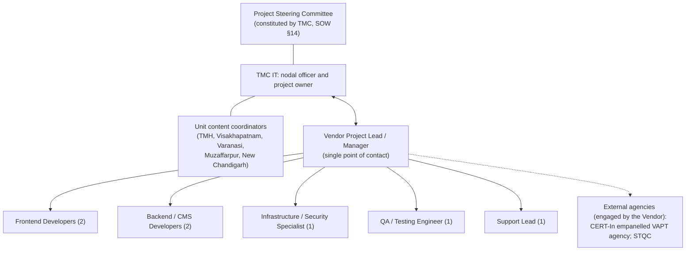

# Team Structure and RACI Matrix

| Document ID | Version | Status | RTM references |
|---|---|---|---|
| TMC-WEB-GOV-02 | 0.1 | Template: names and CVs completed by the bidder | R-10-*, R-14-1, R-14-2, R-11-* |

## 1. Organisation

## 2. Named team (SOW §10)

"The following roles are mandatory and shall be identified in the Technical Bid, supported by curriculum
vitae … Named key personnel shall not be replaced without the prior written consent of TMC." (SOW §10)

| # | Role (SOW §10) | No. | Name | Qualifications and certifications | Relevant experience (years) | Allocation | CV annex |
|---|---|---|---|---|---|---|---|
| 1 | Project Lead / Manager | 1 | [BIDDER TO FILL] | [BIDDER TO FILL] | [BIDDER TO FILL] | [BIDDER TO FILL] % | [ ] |
| 2 | Frontend Developer | 2 | [BIDDER TO FILL]; [BIDDER TO FILL] | [BIDDER TO FILL] | [BIDDER TO FILL] | [ ] % each | [ ] |
| 3 | Backend / CMS Developer | 2 | [BIDDER TO FILL]; [BIDDER TO FILL] | [BIDDER TO FILL] | [BIDDER TO FILL] | [ ] % each | [ ] |
| 4 | Infrastructure / Security Specialist | 1 | [BIDDER TO FILL] | [BIDDER TO FILL] | [BIDDER TO FILL] | [ ] % | [ ] |
| 5 | QA / Testing Engineer | 1 | [BIDDER TO FILL] | [BIDDER TO FILL] | [BIDDER TO FILL] | [ ] % | [ ] |
| 6 | Support Lead | 1 | [BIDDER TO FILL] | [BIDDER TO FILL] | [BIDDER TO FILL] | [ ] % | [ ] |

### 2.1 Responsibilities (SOW §10, expanded for this project)

| Role | SOW §10 responsibilities | In this project |
|---|---|---|
| Project Lead / Manager | Single point of contact; milestone tracking; risk register; liaison with the Project Steering Committee | Execution plan, fortnightly reviews, monthly progress report, risk register, change requests, milestone acceptance, RTM status |
| Frontend Developer (2) | Component library and template coding; frontend interface development; design conformance assurance | Theme `tmc`, design tokens from Annexure A, templates from Annexure B, accessibility (WCAG 2.2 AA / GIGW), application front ends, design deviation register |
| Backend / CMS Developer (2) | CMS configuration, content types, roles and workflow; integration development | `tmc-core` modules, content types and fields, workflow, audit log, search, migration toolkit, gateway, migrations and tests |
| Infrastructure / Security Specialist | Environment provisioning; deployment pipeline; business continuity configuration; security hardening and segregation | Compose stack, provisioning scripts, CI/CD, Production/DR, backups and DR drills, security architecture, segregation tests, VAPT coordination, secrets |
| QA / Testing Engineer | Test planning and execution; performance, cross-browser, and link testing; UAT coordination | Test plan, CI quality gates, UAT scripts and daily status, defect triage, defect closure reports, Go-Live evidence packs |
| Support Lead | Warranty and AMC support; SLA compliance; patch and release management; training coordination | Incident and support model, patch register, monthly support reports, training plan delivery and records |

## 3. RACI matrix

R = Responsible (does the work) · A = Accountable (approves; one per row) · C = Consulted · I = Informed.

| Deliverable / activity | PM | FE | BE | INF | QA | SL | TMC IT | Units | PSC |
|---|---|---|---|---|---|---|---|---|---|
| Project management plan, execution plan | R | C | C | C | C | C | A | I | I |
| Receipt and confirmation of Annexures A–C | R | C | C | I | I | I | A | I | I |
| CMS platform approval | R | C | R | C | I | I | A | I | I |
| Environments Dev/UAT/Production/DR | A | I | C | R | C | I | C | I | I |
| Security architecture document | A | I | C | R | C | I | C (approves at M2) | I | I |
| Data residency statement | A | I | I | R | I | I | C (approves at M2) | I | I |
| Component library and templates | A | R | C | I | C | I | C | C | I |
| Content types, roles, workflow | A | C | R | I | C | I | C | C | I |
| Application front ends and integration | A | R | R | C | C | I | C | I | I |
| Content package (content, translations, approval) | I | I | C | I | I | I | A | R | I |
| Content migration and redirects | A | C | R | I | C | I | C | C | I |
| Post-migration confirmation | I | I | C | I | C | I | A | R | I |
| Test plan and UAT scripts | A | C | C | C | R | I | C (approves) | C | I |
| UAT execution and sign-off | C | C | C | C | R | I | A | R | I |
| VAPT, Safe-to-Host, STQC | A | C | C | R | C | I | C | I | I |
| Observation closure | A | R | R | R | C | I | C | I | I |
| Documentation set | A | C | C | C | C | R | C | I | I |
| Training | A | C | R | R | C | R | C | C | I |
| Milestone acceptance | R | I | I | I | C | I | A | C | C |
| Change requests | R | C | C | C | C | C | A | C | C (schedule/cost impact) |
| Risk register and escalation matrix | A/R | C | C | C | C | C | I | I | I |
| Handover | A | C | C | R | C | R | C (accepts) | I | I |
| Warranty and AMC support, SLA | A | C | C | C | I | R | C | I | I |
| Project closure sign-off | R | I | I | I | I | I | C | I | A |

PM = Project Lead / Manager; FE = Frontend Developers; BE = Backend / CMS Developers; INF = Infrastructure
/ Security Specialist; QA = QA / Testing Engineer; SL = Support Lead; PSC = Project Steering Committee.

## 4. Escalation matrix (project phase)

| Level | Vendor | TMC | When |
|---|---|---|---|
| 1 | Project Lead / Manager [BIDDER TO FILL] | TMC IT nodal officer [TMC TO FILL] | Day-to-day issues; resolved within 3 business days |
| 2 | Vendor delivery head / director [BIDDER TO FILL] | Head, IT Department [TMC TO FILL] | Unresolved after 3 business days; milestone at risk |
| 3 | Vendor chief executive / authorised signatory [BIDDER TO FILL] | Project Steering Committee | Unresolved after 10 business days; contractual matters |

Support-phase escalation (warranty and AMC) is in the
[Incident and Support Model §5](../operations/incident-support-model.md#5-escalation-matrix).

## 5. Personnel changes

Named key personnel are not replaced without TMC's prior written consent (SOW §10). A replacement is
proposed in writing with the CV of a person of equal or better qualification, with a handover period of at
least two weeks, and is recorded in the risk register and the monthly progress report.
