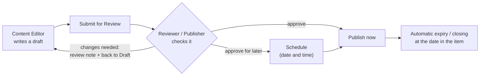

# Content Editor Manual

| Document ID | Version | Status | RTM references |
|---|---|---|---|
| TMC-WEB-MAN-03 | 0.1 | Draft; screens of parallel work streams confirmed at integration | R-4.15-7, R-8.2-6, R-4.16-2, R-4.16-3, R-4.3-2, R-4.6-1, R-4.6-3, R-4.6-5 |

**Audience.** TMC-level and unit-level **Content Editors** (who write and submit content) and
**Reviewer / Publishers** (who check, approve, publish and schedule it). No knowledge of HTML, CSS or
code is needed: every page is built from approved templates, sections and fields.

**Before you start.** You need an account with a role on your website (ask your Site Administrator),
the six-digit code from your authenticator application (for Reviewer / Publishers; W2, verify at
integration), and the content approved by the content owner of your unit. The one-page
[quick reference cards](quick-reference/README.md) summarise this manual for each role.

---

## 1. How publishing works

| You are a… | You can | You cannot |
|---|---|---|
| **Content Editor** | Create and edit drafts (pages, news and notices, tenders, events, job openings, departments, doctors), upload images and documents, submit for review | Publish, schedule, or change anything that is already published |
| **Reviewer / Publisher** | Everything above, plus review, return with a note, publish, schedule, and edit published content | Change site settings, menus or users |

Every step is recorded with your name and the time in the audit trail, and every save keeps a revision
you can compare or restore (§12).

## 2. Signing in and finding your way

1. Go to `https://<your website>/wp-login.php` (from the TMC network or VPN), sign in.
2. The **Dashboard** shows:
   - **My submissions** (Content Editors): your items and their status — *Draft*, *Waiting for
     review*, *Returned for changes* (with the reviewer's note), *Approved — scheduled*, *Published*;
   - **Awaiting your review** (Reviewer / Publishers): items submitted by others, oldest first, with a
     Preview link. The top bar shows **Review queue (n)**.
3. The left menu lists what you can edit: **Posts** (news and notices), **Pages**, **Media**,
   **Tenders & EOIs**, **Events**, **Careers**, **Departments**, **Doctors**.

## 3. Pages

### 3.1 Create a page

1. *Pages → Add New Page*.
2. Type the **title** (it becomes the page heading and, unless changed, the web address).
3. Choose the **page template** for this kind of page in the editor sidebar (template picker with the
   templates of Annexure B; W5, verify at integration).
4. Fill in the content:
   - type text directly; press **Enter** for a new paragraph;
   - click **+** (Add block) for headings, lists, tables, images, files, buttons, or an approved
     **TMC section** from *Patterns → TMC: Page sections*;
   - structure the page with headings in order: **Heading 2** for main sections, **Heading 3** for
     sub-sections (the page title is the Heading 1 — do not add another).
5. In the sidebar under **Page → Page attributes**, choose the **Parent** page so the page sits at the
   right place in the menu, breadcrumbs and sitemap; use **Order** to position it among its siblings.
6. Optional: **Excerpt** — one or two sentences used in listings and search results. Page metadata for
   search engines and social sharing (title, description) is edited in the SEO panel (W3, verify at
   integration).
7. Click **Save draft**, then **Preview** to see it as visitors will.
8. When it is ready: **Submit for Review** (Content Editor) or **Publish** (Reviewer / Publisher).

Colours, fonts and sizes cannot be changed by editors: this keeps every page within the TMC design
system (SOW §5). If a page needs something the templates cannot show, ask your Site Administrator to
raise a change request.

### 3.2 Edit a published page

- **Content Editor:** you cannot change a published page directly. Ask a Reviewer / Publisher, or ask
  them to create a draft copy for you (Change Request not needed).
- **Reviewer / Publisher:** open the page, edit, click **Update**. The change is live immediately and
  recorded in the audit trail with the list of changed fields.

### 3.3 The home page

The home page is built from locked sections (hero banner, quick links, updates, tenders/careers/events,
statistics, about, our institutions). You can change the **text, images and links** inside each section
but you cannot move, delete or restyle the sections; this is intentional. Lists such as *What's new*,
*Latest news*, *Tenders*, *Careers* and *Events* fill themselves from published content; you do not edit
them on the home page.

## 4. News and notices (posts)

1. *Posts → Add New Post*.
2. Title and text as for a page.
3. In the sidebar choose the **Category**: **News** (shown in *Latest news*) or **Notices** (shown on the
   *What's new* notice board). Use the Hindi category for the Hindi version.
4. Time-bound notices: in the **Expiry** box, set **Expires on** (date and time, Indian Standard Time).
   After that moment the notice disappears from the notice board and news lists automatically. Leave it
   empty for items that stay current.
5. Add a **Featured image** if the item will appear as a card.
6. Save, preview, submit for review / publish.

## 5. Tenders and EOIs

1. *Tenders & EOIs → Add Tender / EOI*.
2. **Title**: the subject of the tender as in the tender document.
3. In the editor area: a short description (scope, eligibility summary). Do not paste the whole tender
   document; attach it instead.
4. In the **Details** box below the editor:

| Field | What to enter | Required |
|---|---|---|
| Reference number | Exactly as printed, e.g. `TMH/TMH/2026-27/CAP/EO/0009` | Yes |
| Type | Tender, Expression of Interest (EOI), Request for Proposal (RFP) or Corrigendum | |
| Last date and time of submission | Date and time (IST). After it, the tender moves to the archive automatically | Yes |
| Bid opening date and time | Date and time (IST) | |
| e-Procurement portal link (CPP / GeM) | Full link to the tender on the portal | |
| Documents | Click **Add documents**, upload or choose the PDF files (tender document, annexures, corrigenda), select them (several at once if needed) in the *Select documents* window, click **Add documents**; **Remove** takes one out | |

5. A yellow **Details missing** message at the top means a required field is empty — fill it before
   submitting; reviewers should not approve incomplete items.
6. Save, preview, submit for review / publish.

**Corrigendum or extension.** Open the original tender, add the corrigendum PDF to **Documents**, and
change **Last date and time of submission** if it was extended; the tender re-opens automatically if the
new date is in the future. Publish a separate item of type *Corrigendum* only if your unit's practice
requires it.

**Where it appears:** `/tenders/` (open tenders), `/tenders/?view=archive` (closed), and the *Tenders*
list on the home page.

## 6. Events

1. *Events → Add Event*.
2. Title, description, **Featured image** (optional).
3. **Details**: **Starts** (required), **Ends** (optional; if empty the event is treated as ending at the
   end of its start day), **Venue**, **Registration link**.
4. Save, preview, submit / publish.

**Where it appears:** `/events/` (upcoming, soonest first), `/events/?view=calendar` (month calendar),
`/events/?view=past`, the *Events* list on the home page. Each event page offers **Add to calendar**
(an `.ics` file for Outlook, Google Calendar and phones).

## 7. Careers (job openings)

1. *Careers → Add Job opening*.
2. Title (name of the post), description (eligibility, pay level, how to apply).
3. **Details**: **Advertisement number** (required), **Last date to apply** (required; the opening moves to
   the archive after it), **Number of posts**, **Online application link**, **Documents** (advertisement,
   application form, later the results).
4. Save, preview, submit / publish.

**Where it appears:** `/careers/`, `/careers/?view=archive`, the *Careers* list on the home page.

## 8. Departments and doctors

### 8.1 Department

1. *Departments → Add Department*: name as title, description of services in the editor, optional image.
2. **Details**: Head of department, Location (building / floor), OPD days and timings, Phone, Email.
3. **Order** (sidebar, Page attributes) controls the position in the list; equal numbers sort
   alphabetically.

### 8.2 Doctor

1. *Doctors → Add Doctor*: the doctor's full name as title (with the title used by TMC, e.g. "Dr."),
   profile text, **Featured image** (a professional photograph, with the doctor's consent).
2. **Details**: **Designation** (required), **Departments** (tick one or more; only departments in the
   same language are listed — create the Hindi department first for Hindi profiles), Qualifications,
   Areas of specialisation, OPD days.
3. Save, preview, submit / publish.

Visitors find doctors at `/doctors/` by department and by name.

## 9. Hindi versions (translations)

Every page and item exists in English and, where TMC supplies the text, in Hindi. The two are linked,
so the language switcher takes visitors from one to the other.

1. Create and save the English item first.
2. In the editor sidebar, open the **Languages** panel and click **+** next to **हिन्दी** (Hindi). A new
   Hindi draft opens, linked to the English one.
3. Enter the Hindi title and text supplied by TMC. Fill in the **Details** fields again (dates, reference
   numbers and documents are per language, so the Hindi page can link the Hindi version of a document).
4. Choose the Hindi parent page / Hindi category.
5. Submit for review / publish as usual.

Hindi web addresses use transliterated Latin letters (for example `/hi/rogi-dekhbhal/`); keep the
suggested address or type a short transliteration.

## 10. Images and documents (media)

| Do | Why |
|---|---|
| Write **alternative text** for every image that carries information ("Alt text" in the image settings). Leave it empty only for purely decorative images | Screen-reader users (WCAG 2.2 AA, GIGW) |
| Upload PDFs that contain real text, not scanned pictures of pages; give them a clear title | Accessibility and site search |
| Name files meaningfully, e.g. `eoi-website-2026-corrigendum-1.pdf` | Visitors see the file name |
| Keep images reasonably sized (under about 500 KB for photographs) | Page speed on mobile |
| Upload only material TMC has the right to publish; no patient-identifiable information | Legal and privacy |

*Media → Add New Media File* uploads files; the maximum size is 64 MB. Documents can then be attached to
tenders and job openings (**Add documents**) or linked from a page with the **File** block. The central
document library with document types and filters is described separately when delivered (W1, verify at
integration).

## 11. Review, approval and scheduling

### 11.1 Submitting (Content Editor)

1. Save and **Preview** your item; check the text, links and dates.
2. Click **Submit for Review**. Reviewers of your site are notified by e-mail and see the item in their
   queue. Your **My submissions** panel shows *Waiting for review*.
3. If the reviewer returns it, it appears as **Returned for changes** with the **Review note** (also shown
   in the *Review note* box in the editor sidebar). Make the changes and submit again.

### 11.2 Reviewing (Reviewer / Publisher)

1. Open the item from **Awaiting your review** (or the **Review queue** in the top bar) and use
   **Preview**.
2. Check against the review checklist:
   - content approved by the content owner; facts, dates and reference numbers correct;
   - required details complete (no *Details missing* message);
   - correct parent page / category and language; Hindi version linked where supplied;
   - headings in order, meaningful link text (not "click here"), alternative text on images;
   - documents open and are the right versions;
   - no personal or patient-identifiable information.
3. **To return it:** write what must change in the **Review note** box, click **Save**, then change the
   status from *Pending Review* back to **Draft** and save. The author is notified.
4. **To publish now:** click **Publish**.
5. **To schedule:** in the **Publish** panel click the date ("Immediately"), choose the date and time
   (IST), then **Schedule**. The item goes live automatically at that time (the scheduler runs every
   minute). The author is notified that it was approved and scheduled.

### 11.3 Expiry and closing (automatic)

| Item | Leaves the current lists when | Where it goes |
|---|---|---|
| Notice / news with *Expires on* | That date and time passes | Removed from the notice board and news lists (still reachable by its address) |
| Tender / EOI | *Last date and time of submission* passes | `/tenders/?view=archive`, marked *Closed* |
| Job opening | *Last date to apply* passes | `/careers/?view=archive`, marked *Closed* |
| Event | Its start date is before today | `/events/?view=past` |

No one needs to unpublish these by hand. To re-open a tender or opening (extension), change its date to a
future date.

## 12. Version history

Every save keeps a revision. Open an item and choose **Revisions** in the sidebar (Post/Page panel) to
compare any two versions side by side and, if you have the right to edit the item, **Restore This
Revision**. Restoring creates a new revision, so nothing is lost.

## 13. Writing for the TMC websites

- Plain, clear English (British spelling, as used by the Government of India: *centre*, *programme*).
- Short paragraphs; one idea per paragraph; lists for steps and requirements.
- Dates as `DD/MM/YYYY`, times as `hh:mm AM/PM` IST, currency as `₹`.
- Links: describe the destination ("Download the application form (PDF, 240 KB)"), never "click here".
  Links to other websites open in a new tab and are announced to screen-reader users automatically.
- Tables only for tabular data, with a header row.
- Do not copy formatting from Word with colours or fonts; paste as plain text if the result looks
  different.

## 14. Troubleshooting

| Problem | What to do |
|---|---|
| I cannot see the **Publish** button, only **Submit for Review** | Correct for Content Editors. A Reviewer / Publisher publishes. |
| I cannot edit a page | It is published (Content Editors edit drafts only), or it belongs to another site. Ask a Reviewer / Publisher. |
| "Details missing" message | A required field is empty; fill it in the Details box. |
| The item is not in the listing | Check it is published (not scheduled or pending), in the right language, and that its closing/expiry date has not passed. |
| A scheduled item did not appear on time | Wait two minutes and refresh; if still missing, log a ticket (the scheduler may be stopped). |
| No e-mail notifications | Outbound e-mail may not be configured on this environment; check your dashboard panels. Report it to your Site Administrator. |
| The Hindi version does not appear in the switcher | The translation is not linked or not published; open the English item and check the Languages panel. |

For anything else, contact your Site Administrator or log a **Support incident** ticket
([Incident and Support Model §3](../operations/incident-support-model.md#3-support-channel-logged)).
