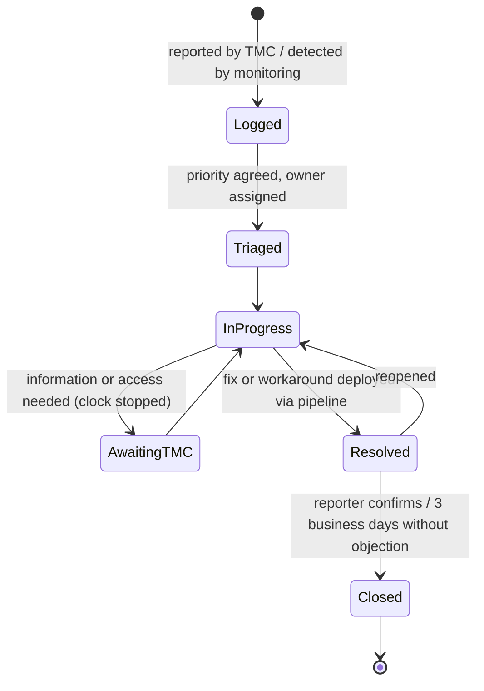

# Incident and Support Model

| Document ID | Version | Status | RTM references |
|---|---|---|---|
| TMC-WEB-OPS-04 | 0.2 | Draft for TMC IT approval | R-6-5, R-6-6, R-6-7, R-6-8, R-6-4, R-4.14-6 |

This document defines how incidents and service requests are reported, prioritised, resolved, escalated
and reported during the warranty (12 months from Project Closure) and the AMC (4 years after warranty)
periods, as required by SOW §6.3 and §6.4.

## 1. Service Level Agreement (SOW §6.4, reproduced verbatim)

| Parameter | Requirement |
|---|---|
| Website availability | 99.5%, measured monthly, excluding planned maintenance notified in advance |
| Critical issue resolution | Within 4 business hours of reporting |
| High priority issue resolution | Within 1 business day |
| Medium priority issue resolution | Within 3 business days |
| Security patch application | Within 30 days of release; critical patches on priority |
| Security and performance review | Quarterly, with a written report to TMC IT |
| VAPT | Annually, by a CERT-In empaneled agency |
| STQC audit | Once every three years, or as required by the applicable standard |

"Costs of all certifications, audits, and renewals specified above shall be borne by the Vendor."
(SOW §6.4)

### 1.1 Interpretation used for measurement (subject to TMC confirmation)

The SOW does not define "business hours", the Low priority, or response times. Until TMC confirms (EOI
query Q-12), the following working definitions are proposed; they do not relax any SOW requirement.

| Term | Proposed definition |
|---|---|
| Business hours | 09:00–18:00 IST, Monday to Saturday, excluding gazetted holidays of the Government of India at Mumbai [TMC TO CONFIRM] |
| Business day | One period of business hours |
| Reporting time | Time the incident is logged in the support channel (§3) by TMC or detected by monitoring, whichever is earlier |
| Resolution | Service restored for users (permanent fix or TMC-accepted workaround); a permanent fix for a workaround follows under the same ticket |
| Clock stops | Only while waiting for information or access that only TMC can provide, recorded in the ticket |
| Availability | (Minutes in month − unplanned downtime minutes) ÷ minutes in month, measured by external HTTP monitoring of each website's home page from within India every minute (Uptime Kuma monitors and `scripts/sla/availability-report.sh`, see [Monitoring](monitoring.md)); planned maintenance notified at least 3 business days in advance is excluded |
| Availability of TMC-owned infrastructure | Outages caused by TMC-owned infrastructure outside the Vendor's control are recorded separately (EOI query Q-08) |

### 1.2 Priority definitions

| Priority | Definition | Examples | Resolution target | Proposed first response |
|---|---|---|---|---|
| **Critical (P1)** | A website or the CMS is unavailable or unusable for all users; security breach or defacement; data loss; suspected route towards clinical systems | Home page down; defaced page; administrator account compromised; database corruption | **4 business hours** (SOW) | 30 minutes, 24×7 for security incidents |
| **High (P2)** | A major function is unavailable or wrong for many users, no workaround | Tenders listing empty; publishing blocked for a unit; search broken; Hindi site down | **1 business day** (SOW) | 2 business hours |
| **Medium (P3)** | A function is impaired but a workaround exists, or a single page/template is affected | One template renders incorrectly on one browser; a scheduled item did not expire | **3 business days** (SOW) | 4 business hours |
| **Low (P4)** | Cosmetic issue, question, documentation, minor service request | Spelling in a label; how-to question; new user account | Proposed: 10 business days or next planned release | 1 business day |

Security vulnerabilities are prioritised by severity: a Critical/High-severity exploitable vulnerability
in a public-facing component is handled as P1; others per the [Patch Management](patch-management.md)
policy.

## 2. Points of contact

| Role | Organisation | Name | Phone | E-mail | Availability |
|---|---|---|---|---|---|
| Support Lead (single point of contact for support) | Vendor | [BIDDER TO FILL] | [BIDDER TO FILL] | [BIDDER TO FILL] | Business hours; on-call for P1 |
| Project Lead / Manager | Vendor | [BIDDER TO FILL] | [BIDDER TO FILL] | [BIDDER TO FILL] | Business hours |
| Infrastructure / Security Specialist | Vendor | [BIDDER TO FILL] | [BIDDER TO FILL] | [BIDDER TO FILL] | On-call for P1 security incidents |
| Senior management escalation | Vendor | [BIDDER TO FILL] | [BIDDER TO FILL] | [BIDDER TO FILL] | Escalation level 3 |
| TMC IT nodal officer | TMC | [TMC TO FILL] | [TMC TO FILL] | [TMC TO FILL] | |
| TMC IT on-call (infrastructure) | TMC | [TMC TO FILL] | [TMC TO FILL] | [TMC TO FILL] | |
| Unit web coordinators (one per unit) | TMC units | [TMC TO FILL] | | | |
| TMC CISO / information security officer | TMC | [TMC TO FILL] | | | |

## 3. Support channel (logged)

| Channel | Use | Logging |
|---|---|---|
| Issue tracker (GitHub Issues of the project repository, or TMC's service desk if TMC prefers) using the **Support incident** form (`.github/ISSUE_TEMPLATE/support-incident.yml`) | All incidents and service requests | Every ticket has a number, timestamps, priority, status history |
| Support e-mail [BIDDER TO FILL] | When the tracker is unavailable; auto-creates or is copied into a ticket by the Support Lead | Ticket created within 30 minutes |
| Telephone (Support Lead / on-call) | **P1 only**, followed by a ticket | Ticket created by the Support Lead immediately |

Tickets must never contain passwords, personal data of patients or other confidential data.

## 4. Incident lifecycle

1. **Log** the ticket with site, URL, steps, time observed, screenshots.
2. **Triage** within the response target; agree priority with the reporter; assign an owner.
3. **Diagnose and fix** in a branch; changes reach Production only through the pipeline (CI, UAT,
   promotion). An emergency fix for a P1 may be promoted after CI with TMC IT's approval recorded in the
   ticket, and UAT confirmation follows.
4. **Resolve**: state the cause, the fix, the release/commit and the verification in the ticket.
5. **Close** after confirmation; P1 and P2 incidents receive a root-cause analysis within 5 business
   days.

## 5. Escalation matrix

| Level | Who | Escalate when (unresolved after) — P1 | P2 | P3 |
|---|---|---|---|---|
| L1 | Support Lead | At logging | At logging | At logging |
| L2 | Project Lead / Manager + Infrastructure/Security Specialist | 2 business hours | 6 business hours | 2 business days |
| L3 | Vendor senior management [BIDDER TO FILL] | 4 business hours (SLA breach) | 1 business day (SLA breach) | 3 business days (SLA breach) |
| TMC | TMC IT nodal officer → Project Steering Committee | Any SLA breach; any security incident | Repeated breaches | Repeated breaches |

## 6. Security incidents

Additional steps for security incidents (defacement, compromise, data exposure, malware, suspicious
administrative activity):

1. **Contain**: TMC IT and the Vendor isolate the affected component (e.g. switch the site to a
   maintenance page at the proxy, disable affected accounts, block source addresses).
2. **Preserve evidence**: export the CMS audit log (CSV) and record *Verify integrity* output; preserve
   container, proxy and host logs; take a database snapshot before changes.
3. **Report**: TMC reports cyber-security incidents to CERT-In within **6 hours** of noticing them, as
   required by the CERT-In Directions of 28 April 2022; the Vendor provides the technical details
   immediately. [TMC TO CONFIRM the internal reporting line.]
4. **Eradicate and recover**: rebuild from the repository and a known-good backup (see
   [Backup and Restoration §4.3](backup-restore.md#43-rebuild-an-environment-from-nothing-new-host-or-dr-activation));
   rotate all secrets ([System and Security Administration Manual §6](../manuals/system-security-administration-manual.md#6-rotating-secrets)).
5. **Review**: root-cause analysis and corrective actions within 5 business days; report to the Project
   Steering Committee.

## 7. Planned maintenance

- Notified to TMC IT and unit coordinators at least 3 business days in advance, with the window, the
  expected impact and the rollback plan.
- Performed in an agreed low-traffic window [TMC TO CONFIRM, proposed Sunday 06:00–08:00 IST].
- Excluded from availability only when notified in advance (SOW §6.4).

## 8. Reporting

| Report | Frequency | Template | Recipient |
|---|---|---|---|
| Monthly support report (incidents, resolution times, SLA compliance) | Monthly, by the 7th of the following month | [Monthly Support Report](templates/monthly-support-report.md) | TMC IT |
| Security and performance review | Quarterly | [Quarterly Security and Performance Review](templates/quarterly-security-performance-review.md) | TMC IT |
| Annual security review (CMS, modules, plugins) | Annually in AMC | [Annual Security Review Report](templates/annual-security-review.md) | TMC IT |
| Defect closure report | Before each Go-Live | `scripts/reports/defect-closure-report.sh` | TMC IT |

The monthly report data can be extracted from the tracker with
`scripts/reports/defect-closure-report.sh --label incident --since <YYYY-MM-DD>` (see the
[Test Plan §10](../testing/test-plan.md#10-defect-management)).
