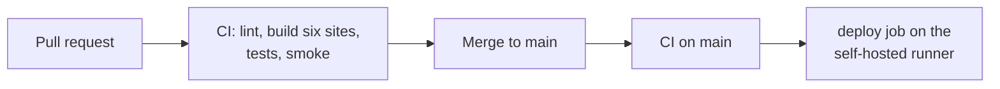

# Installation and Deployment Guide

| Document ID | Version | Status | RTM references |
|---|---|---|---|
| TMC-WEB-OPS-01 | 0.1 | Draft | R-4.15-2, R-4.7-3, R-4.7-4, R-8.2-3, R-8.2-8 |

This guide takes a new server from nothing to live websites, describes routine deployment and rollback,
and lists the pre-Go-Live steps. Everything is done with the scripts in this repository; no manual change
is made on a server. The same steps are used to demonstrate independent build, deploy and operate at
handover (SOW §8.2).

Related: [Configuration Reference](configuration-reference.md) ·
[Backup and Restoration](backup-restore.md) · [System Architecture](../architecture/system-architecture.md)

---

## 1. Prerequisites

### 1.1 Server

| Item | Requirement |
|---|---|
| Operating system | A supported 64-bit Linux distribution with long-term support and current security patches |
| Container runtime | Docker Engine with the Docker Compose v2 plugin (`docker compose version` must work) |
| Tools | `git`, `openssl`, `rsync`, `curl`, `gzip`, `sha256sum` (all used by the scripts) |
| Sizing | See [System Architecture §8.1](../architecture/system-architecture.md#81-indicative-production-sizing) |
| Service account | A non-root user in the `docker` group, e.g. `tmcdeploy`, owning `~/docker/tmc-website` |
| Time | NTP synchronised to NIC/NPL time servers; time zone of the host does not matter (the sites use Asia/Kolkata) |

### 1.2 Network and DNS

| Item | Requirement |
|---|---|
| DNS | `A`/`AAAA` records for the base domain and each unit subdomain (or a wildcard `*.<base>`) pointing to the reverse proxy |
| TLS | Certificate covering the base domain and all unit subdomains, installed on the reverse proxy / perimeter |
| Reverse proxy | Forwards `Host`, `X-Forwarded-For`, `X-Forwarded-Proto` to `tmc-wp:80` (see §4) |
| Egress during provisioning | HTTPS to `wordpress.org`/`downloads.wordpress.org` (core, plugin, language packs), Docker registry, GitHub |
| Egress at runtime | None required, except allow-listed TMC application endpoints |
| Firewall | Zones and flows as in the [Security Architecture](../architecture/security-architecture.md#4-network-and-data-flows) |

### 1.3 Repository and CI

- Access to the Git repository (TMC-owned organisation).
- A GitHub Actions **self-hosted runner** registered to the repository on the server, with the labels
  `self-hosted` and `tmc-server` (the `deploy` job targets `runs-on: [self-hosted, tmc-server]`). The runner
  runs as the service account.

## 2. Local development installation (developer workstation)

```bash
git clone <repository-url> tmc-website && cd tmc-website
make setup     # creates .env (local), builds, installs all six sites, creates demo accounts
make check     # lint + PHP test suites + HTTP smoke test, exactly as CI
make login     # shows the local admin and demo passwords
```

Sites: `http://tmc.localhost`, `http://tmh.tmc.localhost`, … (port 80 on the loopback interface must be
free). `make up` / `make down` start and stop the stack; data is kept in Docker volumes.

## 3. Server installation (UAT, Production, DR)

### Step 1: prepare the directory

```bash
sudo -iu tmcdeploy
mkdir -p ~/docker/tmc-website && cd ~/docker/tmc-website
git clone <repository-url> .      # first time only; afterwards the pipeline syncs the code
```

### Step 2: create the environment file

```bash
./scripts/make-env.sh server      # generates .env with fresh random secrets, mode 600
```

`make-env.sh server` writes the UAT domain. **Before the first installation** edit `.env` and set:

| Variable | Set to |
|---|---|
| `TMC_ENV` | `server` for UAT; `prod` for Production; `dr` on the DR host (`make-env.sh prod` / `dr` write it) |
| `TMC_BASE_DOMAIN` | The base domain of this environment, e.g. `tmc.gov.in` for Production |
| `COMPOSE_FILE` | `docker-compose.yml:compose.server.yml` for UAT; `docker-compose.yml:compose.prod.yml` for Production and DR |
| `WP_ADMIN_EMAIL` | TMC IT's administrative mailbox |

`TMC_BASE_DOMAIN` is written into the network configuration during the first install. Changing it later
requires a search-and-replace of the database (see [Configuration Reference §5](configuration-reference.md#5-changing-the-base-domain)).

Record the generated `TMC_AUDIT_KEY` in TMC IT's offline escrow now (see
[Audit Log Retention Policy §7](../architecture/audit-log-retention-policy.md#7-key-rotation)).

### Step 3: install and provision

```bash
./scripts/setup.sh
```

`setup.sh` is idempotent and performs, in order:

1. `docker compose up -d --build --remove-orphans` and waits for WordPress files to be ready;
2. `scripts/install-network.sh`: installs the Multisite network (first run only), creates the five unit
   sites, applies baseline settings (time zone Asia/Kolkata, date `d/m/Y`, time `h:i A`, permalinks
   `/%postname%/`, search engines discouraged);
3. installs and network-activates Polylang at the pinned version (`POLYLANG_VERSION`), installs Hindi
   and British English language packs;
4. enables the `tmc` theme on the network and activates it on every site;
5. for every site: languages (`setup-languages.php`), home pages (`seed-home-pages.php`), run-once
   migrations (`migrate.php`), pages and menus (`seed-site-structure.php`).

Expected final line: `==> setup complete for <env> (<domain>)`.

### Step 4: route traffic

**UAT (nginx-proxy-manager).** `scripts/deploy.sh` installs `nginx/tmc-website.conf` into the proxy
container as `/data/nginx/custom/http.conf`, tests it with `nginx -t` and reloads; on failure the
previous route is restored automatically.

**Production/DR.** Configure the TMC reverse proxy with a server block equivalent to the following
(TLS termination shown; adapt to TMC's proxy product). With `compose.prod.yml` WordPress listens on the
host's loopback interface, port `TMC_HTTP_PORT` (default 8080); see [environments](environments.md).

```nginx
server {
    listen 443 ssl;
    server_name tmc.gov.in *.tmc.gov.in;
    ssl_certificate     /etc/ssl/tmc/fullchain.pem;
    ssl_certificate_key /etc/ssl/tmc/privkey.pem;
    client_max_body_size 64m;                     # matches upload_max_filesize in wordpress/php.ini
    location / {
        proxy_pass http://127.0.0.1:8080;          # TMC_HTTP_PORT (compose.prod.yml)
        proxy_set_header Host              $host;
        proxy_set_header X-Real-IP         $remote_addr;
        proxy_set_header X-Forwarded-For   $proxy_add_x_forwarded_for;
        proxy_set_header X-Forwarded-Proto $scheme;   # WordPress switches to HTTPS on this header
        proxy_read_timeout 120s;
    }
}
server { listen 80; server_name tmc.gov.in *.tmc.gov.in; return 301 https://$host$request_uri; }
```

The web container trusts `X-Forwarded-For` only from private address ranges (`apache-tmc.conf`), so the
proxy must reach it over a private network.

### Step 5: verify

```bash
./scripts/smoke-test.sh                                      # every site, both languages, key pages
docker compose run --rm -T wpcli --url="$(grep ^TMC_BASE_DOMAIN= .env | cut -d= -f2)" site list --fields=blog_id,url
```

The smoke test must end with `==> smoke test passed`.

### Step 6: first administrator actions

1. Log in at `https://<base>/wp-login.php` as `WP_ADMIN_USER` with `WP_ADMIN_PASSWORD` from `.env`;
   change the password immediately and enrol MFA (W2).
2. Create named Super Admin accounts for the TMC IT officers, then remove Super Admin rights from the
   bootstrap account or disable it (TMC decision).
3. Create site users per the [CMS Administrator Manual](../manuals/cms-administrator-manual.md#4-users-and-roles).
4. Check *Network Admin → Audit Log → Verify integrity*.

## 4. Routine deployment (every release)

Releases are deployed only by the pipeline:



`scripts/deploy.sh <checkout-dir> [target-dir]` (default target `~/docker/tmc-website`) performs:

| Step | Action | Failure behaviour |
|---|---|---|
| 1 | Database backup `backups/pre-deploy-<timestamp>-<sha>.sql.gz` (last 10 kept, mode 600) | Stops the deployment |
| 2 | `rsync --delete` of the code, excluding `.git/`, `.env*`, `demo-users.txt`, `backups/`, `.deployed`, `.release-history` | Stops |
| 3 | `scripts/setup.sh` (idempotent provisioning and migrations) | Stops; sites keep running on the previous containers where not yet recreated |
| 4 | Proxy route update (only if changed), validated by `nginx -t`, automatic restore on failure | Stops, previous route restored |
| 5 | `scripts/smoke-test.sh` | Job fails: investigate and roll back (§5) |
| 6 | Append `<sha> <timestamp> <actor> <run-id>` to `.release-history` and `.deployed` | — |

The job summary in GitHub Actions shows the commit, trigger, actor and result.

**Production promotion.** Promotion to Production is a separate, manually approved workflow
(`.github/workflows/release.yml`): push a tag `vX.Y.Z` on a commit that passed the Pipeline on `main`
(and therefore runs on UAT) and has TMC's UAT sign-off recorded in the change ticket. The workflow checks
the tag, re-runs lint and the integration test, waits for a required reviewer (GitHub environment
`production`) and deploys with `TMC_DEPLOY_TARGET=production` on the production runner. Rolling back is
the same workflow with an older tag ([environments](environments.md)).

## 5. Rollback

1. *GitHub → Actions → Pipeline → Run workflow*, enter the commit SHA or tag of the last good release
   (see `.release-history`), run.
2. The pipeline runs lint and integration tests on that commit, then deploys it with a fresh pre-deploy
   backup.
3. If the release included a **data migration** that must be undone, restore the pre-deploy database
   backup taken before the faulty release (see [Backup and Restoration §4](backup-restore.md#4-restore-procedures)).
   Migrations are forward-only; code rollback alone does not revert data.

## 6. Scheduled jobs

The `cron` container runs `wp cron event run --due-now` for every site every 60 seconds. The TMC job
`tmc_expire_content` runs every 5 minutes. Check it with:

```bash
docker compose logs --tail=50 cron
docker compose run --rm -T wpcli --url=tmh.<base> cron event list --fields=hook,next_run_relative
```

## 7. Pre-Go-Live content clean-up

Seeded sample items carry `_tmc_sample = 1`. Before a site goes live, list them, have the unit confirm,
and delete them:

```bash
wp() { docker compose run --rm -T wpcli "$@" </dev/null; }
BASE="$(grep ^TMC_BASE_DOMAIN= .env | cut -d= -f2)"
URL="tmh.$BASE"                                             # the site going live
wp --url="$URL" post list --post_type=any --post_status=any --lang= --meta_key=_tmc_sample --fields=ID,post_type,post_title
wp --url="$URL" post list --post_type=attachment --post_status=inherit --lang= --meta_key=_tmc_sample --fields=ID,post_title
# after written confirmation from the unit:
wp --url="$URL" post delete $(wp --url="$URL" post list --post_type=any --post_status=any --lang= --meta_key=_tmc_sample --format=ids) --force
wp --url="$URL" post delete $(wp --url="$URL" post list --post_type=attachment --post_status=inherit --lang= --meta_key=_tmc_sample --format=ids) --force
```

Also before Go-Live:

- delete the demonstration accounts (`tmcreviewer`, `tmceditor`, `tmhadmin`, `tmhreviewer`, `tmheditor`)
  if they exist on that environment, and `demo-users.txt`;
- confirm search-engine visibility on Production: `install-network.sh` sets it on for
  `TMC_WP_ENVIRONMENT=production` only, and the SEO module sends `noindex` everywhere else;
- set `TMC_SECURITY_CONTACT` (security.txt) to the contact TMC confirms, and `TMC_DEMO=0`
  (`make-env.sh prod` already does; the DEMO application mock is not started by `compose.prod.yml`);
- complete the Go-Live acceptance checklist in the [Test Plan](../testing/test-plan.md#9-go-live-acceptance-per-website-sow-71).

## 8. Troubleshooting

| Symptom | Check | Remedy |
|---|---|---|
| `setup.sh` stops at "containers" | `docker compose ps`, `docker compose logs db` | Database health check failing: disk space, wrong password in `.env` after first init (the DB keeps the password it was created with) |
| Site shows "Error establishing a database connection" | `docker compose ps db`; `.env` values | Start the stack; do not change `DB_*` after the first install without changing them in MariaDB too |
| All sites 404 / redirect to the wrong host | `TMC_BASE_DOMAIN` vs DNS; proxy `Host` header | Correct the proxy; see Configuration Reference §5 for domain changes |
| Mixed content / login loop behind HTTPS | Proxy sends `X-Forwarded-Proto: https`? | Add the header |
| Scheduled items do not close | `docker compose logs cron` | Recreate the cron container: `docker compose up -d cron` |
| Smoke test fails with "PHP error in page" | `docker compose logs --tail=200 wordpress` | Fix forward or roll back (§5) |
| Proxy route update failed during deploy | Deploy log step 4 | The previous route was restored; fix `nginx/tmc-website.conf` and redeploy |
| E-mail notifications not received | Outbound mail is not configured in this release | Needs the TMC SMTP relay (EOI query Q-23); configuring it is a change request once TMC provides the relay |
