# Patch Management Procedure

| Document ID | Version | Status | RTM references |
|---|---|---|---|
| TMC-WEB-OPS-05 | 0.1 | Draft for TMC IT approval | R-6-3, R-6-2, R-4.8-5, R-6-4 |

SOW §6.2 requires "upgrades of the CMS core, modules, plugins, frameworks, and databases through the AMC
period, with security patches applied within the timelines specified in Section 6.4", and SOW §6.4 sets
"Security patch application: within 30 days of release; critical patches on priority". SOW §4.8 requires
that "all releases shall be subject to vulnerability assessment before promotion to production". This
procedure states how every component is kept current and how a patch reaches Production.

---

## 1. Principles

1. **Every patch is a release.** Patches are applied by changing the repository (a version number, an
   image tag, a Dockerfile line) and deploying through the pipeline: CI → UAT → Production. Nothing is
   updated by hand on a server and nothing is installed from the WordPress administration screens
   (`DISALLOW_FILE_EDIT` is set; plugin and theme installation is limited to Super Admins and is not
   used in Production).
2. **Pinned versions.** Each third-party component is pinned in the repository so that every
   environment runs exactly what was tested (Engineering Conventions, principle 2).
3. **Tested before promotion.** Every patch release passes the full CI suite (build of all six sites,
   PHP test suites, HTTP smoke test) and the CI security gate (W2, verify at integration), and is
   verified on UAT before Production.
4. **Recorded.** Every patch appears in the patch register (§7), the pull request, the pipeline run and
   `.release-history`, and is summarised in the monthly support report.

## 2. Component inventory

| # | Component | Where the version is defined | Update channel | Licence inventory |
|---|---|---|---|---|
| C1 | WordPress core | Base image `wordpress:php8.3-apache` (`wordpress/Dockerfile`); the core files live in volume `wp_html` | WordPress.org releases and security announcements | [THIRD-PARTY-LICENSES](../THIRD-PARTY-LICENSES.md) |
| C2 | PHP 8.3 and Apache httpd | Same base image | Docker Official Images rebuilds | as above |
| C3 | phpredis extension | `pecl install redis` in `wordpress/Dockerfile` | PECL | as above |
| C4 | Polylang plugin | `POLYLANG_VERSION` in `scripts/setup.sh` | WordPress.org plugin directory | as above |
| C5 | Language packs (`hi_IN`, `en_GB`) | Installed by `scripts/setup.sh` | WordPress.org translations | as above |
| C6 | MariaDB | `image: mariadb:11.4` in `docker-compose.yml` (11.4 is a long-term-support series) | Docker Official Images | as above |
| C7 | Redis | `image: redis:7-alpine` in `docker-compose.yml` | Docker Official Images | as above (see §8, observation O-4) |
| C8 | WP-CLI | `image: wordpress:cli-php8.3` (`wpcli`, `cron` services) | Docker Official Images | as above |
| C9 | Project code (`tmc-core`, theme `tmc`) | This repository | Project releases | Project (GPL-2.0-or-later) |
| C10 | CI actions and tools | `.github/workflows/*.yml`, `scripts/lint.sh` | GitHub Marketplace, Docker Hub | as above |
| C11 | Host operating system, Docker Engine | TMC infrastructure (Production/DR); project host (UAT) | Distribution security updates | — |
| C12 | Components added by parallel work streams | Their own files (verify at integration) | Per component | Regenerated by `scripts/licenses.sh` |

## 3. Sources of vulnerability information

The Support Lead reviews these sources at least weekly and on every CERT-In advisory:

- WordPress.org release and security announcements (core) and the changelog of each plugin in use;
- CERT-In advisories and vulnerability notes (<https://www.cert-in.org.in/>);
- the GitHub Advisory Database and the NIST National Vulnerability Database for PHP, Apache httpd,
  MariaDB, Redis and the other components in §2;
- Docker Official Images security rebuild notices;
- the container image and dependency scans of the CI security gate (W2, verify at integration);
- findings from VAPT, STQC and TMC reviews (handled under the
  [Observation Remediation Procedure](security-observation-remediation.md)).

## 4. How updates are applied

### 4.1 Standard flow

```mermaid
flowchart LR
    a["Advisory / new release<br/>identified"] --> b["Assess: severity,<br/>exposure, fix available"]
    b --> c["Branch: change pinned version<br/>(patch register entry)"]
    c --> d["CI: build six sites,<br/>tests, smoke, security gate"]
    d --> e["Merge to main:<br/>automatic UAT deploy"]
    e --> f["UAT verification<br/>(Support Lead + TMC tester)"]
    f --> g["TMC IT approval<br/>(change ticket)"]
    g --> h["Production promotion<br/>(pre-deploy backup, smoke test)"]
    h --> i["Register closed,<br/>monthly report"]
```

### 4.2 Component-specific steps

| Component | How the update is made | Notes |
|---|---|---|
| WordPress core (C1) | Update the core files in `wp_html` to the target version through provisioning, e.g. `wp core update --version=<x.y.z>` followed by `wp core update-db --network`, executed by the pipeline; rebuild the image with `docker compose build --pull wordpress` so PHP/Apache are refreshed at the same time. | The official image copies core into an **empty** `wp_html` volume only on first start, so a newer image alone does not update core on an existing environment. See observation O-1. |
| PHP, Apache (C2), phpredis (C3) | `docker compose build --pull wordpress` in the release; for phpredis pin the version in `wordpress/Dockerfile` (`pecl install redis-<x.y.z>`) | Rebuild recreates the `tmc-wp` container; content is unaffected (volumes). |
| Polylang (C4) | Change `POLYLANG_VERSION` in `scripts/setup.sh` | See observation O-2: provisioning installs the pinned version only when the plugin is absent. |
| Language packs (C5) | `wp language core update` and `wp language plugin update --all` in provisioning | Low risk; included in each release. |
| MariaDB (C6) | Patch releases: `docker compose pull db` and recreate `db` (data in `db_data`). Series upgrade (e.g. 11.4 → next LTS): Change Request, full backup, restore rehearsal on UAT, then Production. | Always take the pre-deploy backup first (automatic in `deploy.sh`). |
| Redis (C7) | `docker compose pull redis` and recreate | Cache only; no data loss on recreate. |
| WP-CLI (C8) | `docker compose pull wpcli cron` | Used by provisioning and the `cron` runner. |
| Project code (C9) | Normal pull request | — |
| CI actions/tools (C10) | Change the pinned tag in the workflow file | Dependabot or an equivalent update bot may raise the pull requests (W7, verify at integration). |
| Host OS, Docker (C11) | TMC's patch process for Production/DR hosts; the Vendor's for UAT during the project | Kernel/Docker restarts are planned maintenance (see [Incident and Support Model §7](incident-support-model.md#7-planned-maintenance)). |

Every release that changes a component version regenerates the licence inventory
(`scripts/licenses.sh`) and states the change in the pull request.

## 5. Timelines

The SOW sets an upper bound of 30 days for every security patch and "priority" for critical patches.
The Vendor commits to the following, measured from the public release of the fix (or from the date the
Vendor is notified, if later):

| Class | Definition | Mitigation in place | Patch in Production |
|---|---|---|---|
| **Critical** | Actively exploited, or CVSS v3 base score 9.0–10.0, in a component reachable from the internet | Within 24 hours (e.g. WAF rule, disabling the affected feature, access restriction) | **Within 72 hours** |
| **High** | CVSS 7.0–8.9, or exploitable by an authenticated low-privilege user | Within 3 business days where a mitigation exists | Within 7 days |
| **Medium / Low** | CVSS below 7.0, or not reachable in this deployment | — | Within 30 days (normally in the next monthly maintenance release) |
| **Non-security update** | Feature or maintenance release | — | Quarterly maintenance release, after UAT |

If an upgrade cannot be applied within the timeline (for example an incompatibility), the Support Lead
records a mitigation, a residual-risk statement and a target date in the patch register and obtains TMC
IT's written acceptance.

## 6. Emergency patch (Critical)

1. The Support Lead logs a P1 ticket and informs TMC IT.
2. The fix is prepared on a branch; CI must pass (the tests are never skipped).
3. With TMC IT's approval recorded in the ticket, the release is promoted to Production after CI, and
   UAT verification follows the same day (see [Incident and Support Model §4](incident-support-model.md#4-incident-lifecycle)).
4. A pre-deploy backup is taken automatically; if the smoke test fails the release is rolled back
   ([Installation and Deployment Guide §5](installation-deployment.md#5-rollback)).

## 7. Patch register

Maintained by the Support Lead (a table in the tracker or this template), reviewed in the monthly
support report and the quarterly review.

| # | Advisory / release reference | Component and version (from → to) | Class | Published on | Mitigation (date) | PR / commit | UAT verified | Production on | Days | Within SLA? |
|---|---|---|---|---|---|---|---|---|---|---|
| 1 | | | | | | | | | | |

## 8. Observations on the current baseline

These points were identified while writing this procedure from the repository. They are tracked as
follow-up items for the integrator and the owning work streams and are listed so that TMC has a complete
picture.

| # | Observation | Consequence | Proposed action | Owner |
|---|---|---|---|---|
| O-1 | `WP_AUTO_UPDATE_CORE` is `minor`, but background updates run through WP-Cron, which runs in the `cron` container on the internal network without internet access; and the core files persist in `wp_html`. | Minor core updates do not install themselves. This is acceptable (controlled change is preferred) but core must be updated deliberately. | Provisioning pins and applies the core version (`wp core update --version=…`), making core updates a normal release. | W7 / W2 (verify at integration) |
| O-2 | `setup.sh` installs Polylang `POLYLANG_VERSION` only when it is not installed. | Raising `POLYLANG_VERSION` does not upgrade existing environments. | Provisioning compares the installed version with the pinned one and runs `wp plugin install polylang --version=<pinned> --force` when they differ. | W7 (verify at integration) |
| O-3 | Base images use series tags (`wordpress:php8.3-apache`, `mariadb:11.4`, `redis:7-alpine`, `wordpress:cli-php8.3`), and `setup.sh` builds without `--pull`. | Environments built at different times can run different patch levels. | Pin exact tags (or digests) and update them through this procedure; build with `--pull` in releases. | W7 (verify at integration) |
| O-4 | `redis:7-alpine` currently resolves to Redis 7.4.x, which is licensed under RSALv2/SSPLv1 — not an OSI-approved licence. | Conflicts with the GPL/OSI-only principle and SOW §13 ("licensed on terms compatible with Government deployment"). | Replace with a BSD-3-Clause build: `valkey/valkey` (Linux Foundation fork, drop-in compatible) or pin `redis:7.2.x-alpine`; or Redis 8.x under its AGPLv3 option after TMC's legal review. | W7 (verify at integration) |
