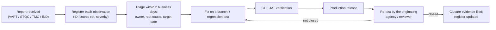

# Observation Remediation Procedure

VAPT, STQC, TMC security reviews and independent design/quality reviews

| Document ID | Version | Status | RTM references |
|---|---|---|---|
| TMC-WEB-OPS-06 | 0.1 | Draft for TMC IT approval | R-4.8-9, R-5-2, R-4.8-7, R-6-4, R-7.1-1 |

## 1. Purpose

SOW §4.8: "All observations arising from VAPT, STQC, or TMC's own security review shall be closed by the
Vendor at no additional cost to TMC."
SOW §5: "TMC reserves the right to have the implemented design and the delivered website ecosystem
independently reviewed or validated, either by TMC or by an agency appointed by TMC, at any stage of the
project and during the warranty and AMC periods. Observations arising from such review shall be addressed
by the Vendor within the timelines advised by TMC."

This procedure defines how every such observation is recorded, fixed, re-tested and closed, and how
closure is evidenced for the Go-Live acceptance (SOW §7.1: "VAPT completed and all observations
closed").

## 2. Sources of observations

| Code | Source | Typical timing |
|---|---|---|
| VAPT | CERT-In empanelled agency: vulnerability assessment and penetration test | Before each Go-Live (M4, M5), final report at M6, annually in AMC |
| STQC | STQC audit / certification | M6; re-certification every three years or as the standard requires (SOW §6.4) |
| TMC-SEC | TMC's own security review (TMC IT, CISO) | Any time |
| IND | Independent review or validation by TMC or a TMC-appointed agency (design conformance, accessibility, quality) | Any stage, including warranty and AMC (SOW §5) |
| INT | The project's own pre-assessment: CI security gate, pre-VAPT readiness review, accessibility and performance scans (W2, W6) | Every release; before submitting to external agencies |

## 3. Principles

1. **No cost to TMC.** Every observation from VAPT, STQC, TMC security review or an independent review is
   closed by the Vendor at no additional cost, including re-testing fees of the certifying agency.
2. **TMC's timeline prevails.** Where TMC advises a timeline (SOW §5), it applies. Otherwise the default
   targets in §5 apply.
3. **Fix the cause, not only the instance.** Each fix is checked across all six websites and all
   templates, because the sites share one code base.
4. **Fix through the pipeline.** Every fix is a normal release (CI, UAT, Production). Where possible a
   regression test is added (`scripts/tests/` or `scripts/smoke.d/`) so the observation cannot return.
5. **Evidence for every closure.** Commit, test result and re-test report are recorded.

## 4. Process

1. **Register.** The Support Lead (or Project Lead during implementation) records every observation in
   the register (§6) within one business day of receiving the report, using the source's own reference
   so the re-test can be matched.
2. **Triage.** Within two business days: severity confirmed with TMC IT, owner assigned, root cause
   identified, target date set per §5. Observations that are false positives or accepted risks are
   documented with a justification and require TMC IT's written acceptance; they are never closed
   unilaterally.
3. **Fix and verify.** Fix on a branch; add a regression test; CI must pass; verify on UAT.
4. **Release.** Promote to Production through the pipeline.
5. **Re-test.** Request re-test from the originating party (VAPT agency, STQC, TMC, independent agency).
6. **Close.** Record the re-test outcome, attach the evidence, and report the status in the monthly
   progress/support report. Certificates (Safe-to-Host, STQC) are requested only when all observations
   of the corresponding report are closed.

## 5. Default target dates

Used when TMC has not advised a timeline. Days are calendar days from receipt of the report.

| Severity (as rated by the source; CVSS v3 for security findings) | Fix released to Production | Re-test requested |
|---|---|---|
| Critical | 3 days (mitigation within 24 hours) | Immediately after release |
| High | 7 days | Immediately after release |
| Medium | 15 days | With the next batch, within 30 days |
| Low / Informational | 30 days | With the next batch |
| Design-conformance or accessibility observation (IND) | As advised by TMC; otherwise 15 days | On release |

Before a Go-Live the rule is stricter: **all** observations of the pre-Go-Live VAPT must be closed and
re-tested (SOW §7.1).

## 6. Observation register (template)

| Obs. ID | Source and report ref. | Date received | Site(s) / URL / component | Title | Severity | OWASP / WCAG / GIGW ref. | Root cause | Owner | Target date | Fix (PR / commit) | Regression test | In Production on | Re-test date and result | Status | Evidence ref. |
|---|---|---|---|---|---|---|---|---|---|---|---|---|---|---|---|
| VAPT-2027-01-001 | | | | | | | | | | | | | | Open | |

Status values: *Open*, *In progress*, *Fixed – awaiting re-test*, *Closed*, *Risk accepted by TMC
(ref. …)*.

## 7. Closure report

For each report the Vendor submits a closure report to TMC IT:

| Section | Content |
|---|---|
| 1. Summary | Source, report reference and date, number of observations by severity, all closed (yes/no) |
| 2. Register extract | All observations of the report with status *Closed* or *Risk accepted by TMC* |
| 3. Evidence | Re-test report of the originating party; commit and pipeline references; screenshots where relevant |
| 4. Regression protection | Tests added to CI (file names) |
| 5. Lessons learned | Changes to coding standards, templates or procedures |
| Sign-off | Vendor Project Lead / Infrastructure-Security Specialist; accepted by TMC IT |

The closure report is part of the Go-Live acceptance pack ([Test Plan §9](../testing/test-plan.md#9-go-live-acceptance-per-website-sow-71))
and of the [Quarterly Security and Performance Review](templates/quarterly-security-performance-review.md).
