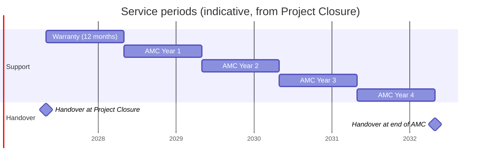

# Warranty and Annual Maintenance (AMC) Plan

| Document ID | Version | Status | RTM references |
|---|---|---|---|
| TMC-WEB-OPS-07 | 0.1 | Draft for TMC IT approval | R-6-1, R-6-2, R-6-3, R-6-4, R-6-5, R-6-8, R-8.2-\* |

## 1. Contractual basis

| Clause | Requirement |
|---|---|
| SOW §6.1 Warranty | "Twelve (12) months from Project Closure (Go-Live of all websites in scope), covering defect rectification, security fixes, performance stabilization, and support, at no additional cost to TMC." |
| SOW §6.2 AMC | "Four (4) years following the warranty period, covering preventive maintenance, CMS and content support, security hardening, performance tuning, and minor enhancements within the agreed scope", including upgrades of core, modules, plugins, frameworks and databases; annual VAPT; Safe-to-Host renewal; STQC re-certification as due; an annual security review report. |
| SOW §6.3 Post-Go-Live support | Points of contact, escalation matrix, logged support channel; monthly support report. |
| SOW §6.4 SLA | Availability 99.5 %; Critical 4 business hours; High 1 business day; Medium 3 business days; security patches within 30 days, critical on priority; quarterly review; annual VAPT; STQC once every three years or as required. Costs of all certifications, audits and renewals borne by the Vendor. |
| SOW §8.2 Handover | Complete handover at Project Closure **and again at the conclusion of the AMC period**. |

The start date of the warranty depends on the definition of Project Closure: SOW §6.1 equates it with
"Go-Live of all websites in scope" (milestone M5), while the milestone table places Project Closure at
M6 (certification, training, handover). The Vendor has asked TMC to confirm the date (EOI query Q-19).

## 2. Service periods

Dates in the chart are placeholders for illustration; the actual dates follow the contract award date
and TMC's confirmation of Project Closure.

## 3. What is covered

| Service | Warranty (12 months) | AMC (4 years) |
|---|---|---|
| Defect rectification (anything not working as accepted) | Yes, no cost | Yes (preventive and corrective maintenance) |
| Security fixes and patching per [Patch Management](patch-management.md) | Yes | Yes |
| Upgrades of CMS core, plugins, frameworks, database, container images | Yes (security and maintenance releases) | Yes, including major-version upgrades planned through Change Requests where they change behaviour |
| Performance stabilisation and tuning | Yes | Yes |
| Security hardening | Yes | Yes |
| CMS and content support to administrators and editors (how-to, troubleshooting, publishing assistance) | Yes | Yes |
| Minor enhancements within the agreed scope | As agreed | Yes (definition in §5) |
| Helpdesk, incident response, SLA per SOW §6.4 | Yes | Yes |
| Quarterly security and performance review report | Yes | Yes |
| Annual VAPT by a CERT-In empanelled agency | — (final VAPT at M6) | Every year, at the Vendor's cost |
| Safe-to-Host certificate renewal | As required | As required, at the Vendor's cost |
| STQC re-certification | — | As due (once every three years or as the standard requires), at the Vendor's cost |
| Annual security review report (CMS, modules, plugins) | — | Every year ([template](templates/annual-security-review.md)) |
| Closure of all VAPT / STQC / TMC observations | Yes, no cost | Yes, no cost ([procedure](security-observation-remediation.md)) |
| Documentation kept current (updated at each release) | Yes | Yes |
| Refresher training for new editors | On request, online | On request, online (proposed: up to two sessions per year) [TMC TO CONFIRM] |
| DR drill (RPO 15 min / RTO 1 h) | Quarterly | Quarterly |
| Handover | — | Complete handover at the end of the AMC (§8) |

**Not covered** (handled as Change Requests under SOW §14): new websites or units beyond the six, new
content types or page templates not in Annexure B, new integrations, redesign, and content creation or
translation (content is TMC's).

## 4. Preventive maintenance calendar

| Frequency | Activity | Output |
|---|---|---|
| Daily (automated) | Backup jobs and verification; uptime monitoring of each website; CI on every change | Monitoring alerts (W7, verify at integration) |
| Weekly | Review of vulnerability sources ([Patch Management §3](patch-management.md#3-sources-of-vulnerability-information)); check of backup success and disk usage; check of `cron` container and expiry job | Patch register entries |
| Monthly | Maintenance release (patches, language packs, image refresh) through the pipeline; broken-link scan of all sites; audit-log review of privileged events; account review of vendor access; monthly support report | [Monthly Support Report](templates/monthly-support-report.md) |
| Quarterly | Audit-log integrity verification and archive export; DR restore drill with measured RPO/RTO; performance benchmark of every template; accessibility scan; user-access review by site administrators; Quarterly Security and Performance Review | [Quarterly Review](templates/quarterly-security-performance-review.md), DR drill record |
| Annually | VAPT (CERT-In empanelled agency); Safe-to-Host renewal as required; annual security review report; licence inventory review; review of this plan, the SLA measurements and the documentation set | [Annual Security Review](templates/annual-security-review.md) |
| Every three years (or as required) | STQC re-certification | Certificate |

## 5. Minor enhancements

SOW §6.2 includes "minor enhancements within the agreed scope" but does not define them. Proposed
definition, for TMC's confirmation [TMC TO CONFIRM]:

A **minor enhancement** is a change that (a) uses the existing platform, content types and design
system, (b) needs no new external integration and no change to the security architecture, and
(c) can be delivered, tested and documented within **5 person-days**. Examples: a new field on an
existing content type; a new listing filter; a new menu location; an additional block variant already
covered by the design system; a new report from existing data.

Proposed allowance: up to [BIDDER TO FILL] person-days per AMC year, tracked in the monthly support
report. Anything larger is a Change Request (SOW §14).

## 6. Support organisation

Points of contact, support channel, priorities, escalation matrix and SLA measurement are defined in the
[Incident and Support Model](incident-support-model.md). The Support Lead (SOW §10) is responsible for
warranty and AMC delivery, SLA compliance, patch and release management and training coordination.

## 7. Reporting during warranty and AMC

| Report | When | Template |
|---|---|---|
| Monthly support report (incidents, resolution times, SLA compliance, availability, patches) | By the 7th of each month | [Monthly Support Report](templates/monthly-support-report.md) |
| Quarterly security and performance review | Within 15 days of quarter end | [Quarterly Security and Performance Review](templates/quarterly-security-performance-review.md) |
| Annual security review report (CMS, modules, plugins) | Within 30 days of each AMC year end | [Annual Security Review Report](templates/annual-security-review.md) |
| VAPT report and closure report | Annually | Agency report + [closure report](security-observation-remediation.md#7-closure-report) |

## 8. End-of-AMC handover

At the end of the AMC the complete handover of SOW §8.2 is repeated using the
[Handover Checklist](handover-checklist.md), with the repository, documentation and licence inventory
brought up to date, all vendor access removed and all credentials the Vendor has known rotated.
