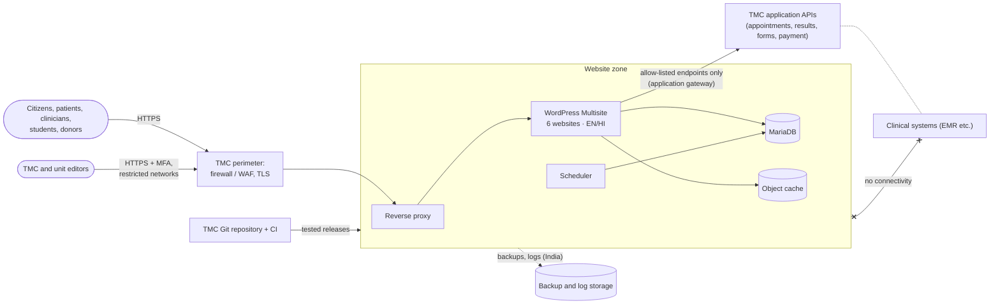

# 01 Proposed Technical Solution and Architecture

| Document ID | Version | RTM references |
|---|---|---|
| TMC-WEB-PRP-02 | 0.1 | R-12.1-*, R-2-*, R-4.1-*, R-4.3-*, R-4.7-*, R-4.12-* (evaluation parameter 1: 15 marks) |

## 1. Understanding of the requirement

TMC requires one secure, accessible, citizen-centric ecosystem for the TMC umbrella website and five
constituent unit websites (TMH Mumbai; HBCH & RC Visakhapatnam; MPMMCC / HBCH Varanasi; HBCH & RC
Muzaffarpur; HBCH New Chandigarh) on a common platform, CMS and security framework (SOW §1, §4.1). The
design system, IA, templates and Figma designs are supplied by TMC and binding; the Vendor implements them
without design work (SOW §3). TMC develops and hosts its own applications (appointments, results, forms,
payments, EMR); the Vendor builds only their front-end presentation layer and connects it through
TMC-approved endpoints, with no access to clinical or patient data (SOW §4.4). The public website must be
segregated from clinical systems so that a compromise of the website gives no route into them (SOW §4.8).
The Vendor delivers documentation, training, 12 months' warranty and 4 years' AMC, and hands over
everything free of lock-in (SOW §6, §8, §13).

## 2. Solution overview

| Layer | Proposed solution |
|---|---|
| CMS | **WordPress Multisite** (subdomain network): one installation, one code base, one user directory and one security framework for all six websites ([CMS justification](02-cms-justification.md)) |
| Presentation | A custom GPL theme implementing Annexure A as design tokens (`theme.json`), the Annexure B templates and the component library; editors fill defined fields and locked sections, and cannot alter typography, colours or spacing |
| Business rules | A must-use plugin (`tmc-core`) containing the project's modules: editorial roles, review workflow, tamper-evident audit log, content types (tenders/EOIs, events, careers, departments, doctors, news/notices) with structured fields and automatic expiry; further modules for search, security, SEO/redirects, application gateway and network publishing |
| Multilingual | English and Hindi at Go-Live with Polylang (GPL); further languages added without template changes (SOW §4.13) |
| Runtime | Containers: Apache + PHP 8.3 (official WordPress image), MariaDB 11.4, a Redis-compatible object cache, a scheduler container; configuration from environment files; no external CDN or third-party script at runtime |
| Delivery | Git repository owned by TMC; CI builds all six sites from scratch and runs the test suites on every change; automated deployment to UAT; controlled promotion to Production; rollback by redeploying an earlier release |

This solution is already implemented as a working baseline in the project repository (six sites, roles,
workflow, audit log, content types, CI/CD to UAT) and is extended during the project with the Annexure
A–C designs and the remaining features; see the [System Architecture Document](../architecture/system-architecture.md).

## 3. Architecture

Detailed views: [System Architecture](../architecture/system-architecture.md) (components, containers,
data flows, environments, scaling), [Security Architecture](../architecture/security-architecture.md)
(zones, flows, access control, logging, keys), [Integration and Interfaces](../architecture/integration-interfaces.md),
[Data Model](../architecture/data-model.md).

## 4. How the SOW outcomes are met

| SOW requirement | Approach |
|---|---|
| §4.3 Editors create any page by selecting a template and filling defined fields, without HTML/CSS/code | Page templates with locked (`contentOnly`) sections and structured field boxes per content type; design tokens not editable |
| §4.3 Site-wide navigation, header, footer, breadcrumbs, sitemap, search, event calendar, maps, social links | Theme components: keyboard-accessible mega-menu, breadcrumbs, HTML and XML sitemaps, month calendar with `.ics`, accessible location block with text address, social links per site, full-text search with suggestions across pages and documents |
| §4.4 Front ends for TMC applications | Server-side application gateway with an allow-list of approved endpoints; internal URLs never exposed; no persistence of submitted personal data |
| §4.6 Code-free editing; RBAC with central TMC-wide and unit-level publishing; review workflow; version history and audit trail; scheduling and automatic expiry; central media/document libraries; multilingual; secured admin | Four roles (Super Admin, Site Administrator, Reviewer / Publisher, Content Editor); review queue and return-with-note; revisions; HMAC-chained audit log with integrity check and CSV export; scheduling and date-driven expiry of tenders, openings, notices and events; document library; network publishing of TMC-wide notices to selected unit sites; MFA and admin network restriction |
| §4.7 Hosting on TMC infrastructure in India; Dev/UAT/Production/DR; auditable promotion and rollback; TMC ownership, logged vendor access; RPO 15 min / RTO 1 h; backups; peak load and scaling | Host-agnostic container stack deployable on TMC-owned or MeitY-empanelled cloud in TMC's name; identical scripts for every environment; pipeline with pre-deploy backup and release record; 15-minute database backups with off-host copies and a timed quarterly DR drill; object and page caching; horizontal scaling (§6) |
| §4.9 WCAG 2.2 AA, GIGW 3.0, responsive, browsers | Accessibility built into every component (skip link, text size, contrast mode, focus visibility, pause for moving content, semantic markup); automated accessibility, cross-browser and responsive tests in CI |
| §4.10 SEO, performance, analytics | Clean URLs, editor-managed metadata, structured data, sitemaps and robots per environment, redirect manager, performance budgets per template, TMC-approved analytics with India-resident option |
| §4.11 Migration | Inventory-driven import to templates and content types, redirects for old URLs, automated zero-broken-link and orphan scan ([methodology](04-content-migration-methodology.md)) |

## 5. Environments and hosting

| Environment | Purpose | Hosting | Build |
|---|---|---|---|
| Development | Engineering | Developer workstations | `make setup` (same scripts) |
| CI | Automated verification of every change | Ephemeral runners | Builds all six sites from nothing per run |
| UAT | TMC acceptance testing and demonstrations | TMC-designated or project host (private network) | Automatic deployment after CI on the main branch |
| Production | Live websites | TMC-owned or TMC-subscribed infrastructure; MeitY-empanelled cloud in TMC's name if cloud is used; all data in India | Promotion of a UAT-accepted release |
| Disaster Recovery | Continuity | Separate TMC site or region in India | Same scripts; restore of the latest backup set |

Hosting prerequisites and indicative sizing are in the
[System Architecture §8](../architecture/system-architecture.md#8-hosting-requirements-sow-47); the
[Data Residency Statement](../architecture/data-residency-statement.md) is submitted at M2.

## 6. Scalability and extensibility

- **More traffic:** object cache and page cache; vertical scaling; then several web containers behind a
  load balancer with shared uploads storage and the existing database and cache.
- **More units:** a documented procedure adds a website with no code change beyond the provisioning site
  list ([CMS Administrator Manual §8](../manuals/cms-administrator-manual.md#8-adding-a-new-unit-website)).
- **More languages:** added in the CMS; interface strings are already wrapped for translation.
- **More features and integrations:** each is a new module file and, for existing sites, a versioned data
  migration; the gateway registers new endpoints without changing existing ones.

## 7. Business continuity

| Target | Approach |
|---|---|
| RPO 15 minutes | Database backup every 15 minutes, copied off the Production host to storage in India; uploads backed up daily and incrementally |
| RTO 1 hour | DR host kept ready; scripted rebuild (provision → restore database → restore uploads → verify → switch traffic), rehearsed quarterly with measured times ([Backup and Restoration §4.3](../operations/backup-restore.md#43-rebuild-an-environment-from-nothing-new-host-or-dr-activation)) |
| Evidence | Quarterly DR drill record with achieved RPO and RTO, reported to TMC |

## 8. Assumptions

1. Production and DR infrastructure, network zones, DNS and TLS for `*.tmc.gov.in` are provided by TMC
   (SOW §4.7), with the Vendor specifying the requirements at M1 (EOI query Q-22).
2. Performance thresholds and peak load will be agreed at M2 (Q-07).
3. TMC provides the list of applications in scope, their API specifications and test endpoints (Q-09).
4. The overall schedule follows the milestone table to T + 210 days (Q-01).
