# 04 Content Migration Methodology

| Document ID | Version | RTM references |
|---|---|---|
| TMC-WEB-PRP-05 | 0.1 | R-4.11-1 to R-4.11-5, R-2-4, R-7.1-1 (evaluation parameter 8, with 05: 8 marks) |

## 1. Scope and principles

SOW §4.11: TMC provides the approved content; the Vendor migrates it, formats it and maps it to the
approved templates and content types, ensures it is complete, correctly rendered and correctly placed in
the IA, configures redirects for superseded URLs, ensures zero broken links and no orphaned pages
(automated scan, clean report before Go-Live), and coordinates receipt and post-migration confirmation
with TMC and the unit coordinators. The Vendor does not audit, validate or restructure the content.

Principles:

1. **Inventory-driven.** Every item to be migrated has one row in a content inventory with its target
   site, language, content type, template, parent page and old URL. The inventory is the contract for
   completeness.
2. **Repeatable, scripted import.** Content is imported by the migration toolkit from the inventory and
   files, never retyped page by page; imports can be re-run on UAT until correct, then on Production.
3. **Verify automatically, confirm by people.** Completeness, links, orphans and redirects are checked by
   tools; rendering and correctness of placement are confirmed by the unit.
4. **No loss of old links.** Every old URL either redirects (301) to its new page or returns 410 Gone
   when TMC withdraws the content.

## 2. Process

```mermaid
flowchart LR
    a["1 Plan<br/>IA (Annexure B),<br/>inventory template"] --> b["2 Receive<br/>content package<br/>per unit (EN + HI)"]
    b --> c["3 Check<br/>completeness,<br/>raise queries"]
    c --> d["4 Map<br/>items → templates,<br/>content types, parents"]
    d --> e["5 Import to UAT<br/>(toolkit, dry run first)"]
    e --> f["6 Verify<br/>counts, rendering,<br/>links, orphans, redirects"]
    f --> g["7 Unit review<br/>on UAT, corrections"]
    g --> h["8 Freeze + final<br/>import to Production"]
    h --> i["9 Post-migration<br/>scan + sign-off"]
```

| Step | Activity | Output |
|---|---|---|
| 1 Plan | Agree the IA and page-to-template mapping from Annexure B; issue the inventory template and schedule to each unit | Migration plan per site |
| 2 Receive | Unit coordinator delivers text, documents, images, structured items and the old-URL list | Content package ([coordination procedure](../operations/content-migration-coordination.md)) |
| 3 Check | Completeness check within 3 business days; queries for missing files, missing translations, broken references | Query log |
| 4 Map | Assign template, content type, parent and slug to each item; map old URLs to new URLs | Mapping sheet (part of the inventory) |
| 5 Import | Dry run (report only), then import on UAT: pages with parents and order; posts with categories and expiry; tenders, openings, events, departments and doctors with their structured fields; documents and images into the media library with titles and alternative text; English and Hindi versions linked as translations | Import report (created / updated / skipped / errors) |
| 6 Verify | Inventory vs imported counts; automated crawl for broken links and orphaned pages; redirect check of every old URL; HTML validity and accessibility scan of migrated pages | Post-migration verification report |
| 7 Unit review | Unit reviews on UAT (at least 10 % of pages and every template type) and corrects content through the CMS or a revised package | Review notes |
| 8 Freeze and final import | Content freeze on the old site; final import to Production with the same toolkit | Production import report |
| 9 Sign-off | Clean link/orphan report; post-migration confirmation signed by the unit and TMC | Signed confirmation (Go-Live criterion) |

## 3. Tooling

| Need | Tool |
|---|---|
| Import from inventory (CSV) and files into pages, posts and content types, idempotent re-runs | Migration toolkit on WP-CLI (work stream W3; command names verified at integration) |
| Mapping to templates and fields | Content-type field schema (`tmc_field_schema()`) — the same schema drives the editor, so imported items are indistinguishable from edited ones |
| Redirects (301/410), bulk import from the old-URL list, hit log | Redirect manager (W3) |
| Broken links and orphans | Crawler with orphan detection against the sitemap and navigation (W6) |
| Translations | Polylang translation links set by the importer |
| Evidence | Import and verification reports archived with the release |

Content is imported with the importing user recorded; every created item appears in the audit log, and
the import can be reconciled against the inventory at any time.

## 4. Quality controls

| Control | Criterion |
|---|---|
| Completeness | Every approved inventory row imported (count and ID match) |
| Placement | Parent, menu position and URL as in the mapping |
| Rendering | Template-specific checks; no raw HTML or pasted styling; headings in order |
| Documents | Opening, correct version, title set; scanned PDFs flagged to the unit for accessible replacements |
| Images | Alternative text present for informative images |
| Links | Zero broken internal links; external links checked and reported |
| Orphans | Zero pages unreachable from navigation, listings or the sitemap |
| Redirects | Every old URL returns 301 to the mapped page, or 410 where withdrawn |
| Sample content | All `_tmc_sample` items removed before Go-Live |

## 5. Schedule

Per site, relative to its Go-Live date G: inventory and IA issued at G − 60 days; package received at
G − 45; UAT import at G − 30; unit review until G − 20; final import at G − 7; sign-off before G. The TMC
website and the pilot unit are migrated for M4, the remaining four units for M5.

## 6. Information requested

Volume of pages and documents per site, source systems and formats, and the old-URL inventory are
requested in EOI query Q-10 for accurate planning.
