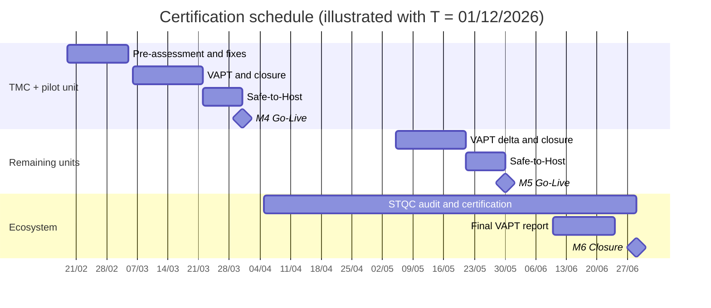

# 06 Security and Compliance Approach

| Document ID | Version | RTM references |
|---|---|---|
| TMC-WEB-PRP-07 | 0.2 | R-4.8-1 to R-4.8-9, R-2-6, R-4.7-1/2/5, R-4.9-1, R-6-4 (evaluation parameter 3: 15 marks) |

## 1. Objective

"A compromise, defacement, or vulnerability in the public website or CMS cannot provide any route into
EMR, patient registration, appointment, payment, or other clinical systems" (SOW §4.8). The approach
combines segregation by design, no clinical data on the website, strong administrative access control,
tamper-evident logging, secure delivery, and independent certification. The full design is the
[Security Architecture Document](../architecture/security-architecture.md), submitted for approval at M2
and re-validated before each Go-Live.

## 2. Segregation from clinical and patient-service systems

| SOW §4.8 requirement | Approach |
|---|---|
| Segregated network zone; no direct connectivity to clinical systems, databases, patient data stores, internal file shares | Website zones (DMZ, web application, web data, management) on infrastructure separate from the clinical zone; default-deny egress towards TMC internal ranges; the database and cache sit on an internal network with no internet and no host ports |
| Interaction only through TMC-approved, controlled, allow-listed endpoints | Server-side application gateway: only registered endpoint IDs, credentials from the environment, rate control, metadata-only logging, internal URLs never sent to browsers; the same allow-list enforced on the firewall |
| Separate infrastructure accounts, databases, credentials | Own database instance and users, own secrets per environment, TMC-owned accounts |
| No clinical or patient data on the website (SOW §4.4) | Application front ends pass data through and store nothing; verified in every CI run by `scripts/tests/apps-test.php`, which submits a unique marker through the gateway and then searches the content, user, option and audit tables of all sites for it |
| Evidence | Segregation tests S-1 to S-6 at M2 and before each Go-Live, witnessed by TMC IT ([Security Architecture §3.1](../architecture/security-architecture.md#31-segregation-validation-test-performed-at-m2-and-before-each-go-live)) |

## 3. Access control

| Control | Approach |
|---|---|
| Role-based authorisation | Super Admin (TMC IT only), Site Administrator, Reviewer / Publisher, Content Editor; no role can publish without review except reviewers; unit isolation; verified per role in CI |
| Multi-factor authentication | TOTP mandatory for Super Admin, Site Administrator and Reviewer / Publisher (Two Factor plugin, enforced by `TMC_ENFORCE_MFA`; `security-test.php`); for all infrastructure access |
| Restricted network access | CMS administration and SSH only from TMC networks or the TMC-approved VPN/bastion |
| Vendor access | No standing access to Production/DR; named, ticket-based, time-bound, logged; data never copied out ([Access Control and Vendor Access Policy](../architecture/access-control-policy.md)) |
| Hardening | File editing disabled; code read-only at runtime; no PHP execution in uploads; XML-RPC disabled; version disclosure removed; security headers incl. nonce-based CSP, HSTS and cross-origin isolation headers; `security.txt`; login lockout; user-enumeration blocking; rate limiting of public endpoints — all tested in CI (`security-test.php`, 127 checks) |

## 4. Audit logging and log retention

- **Tamper-evident CMS audit log** of every administrative action on all six sites (logins, content
  lifecycle, users and roles, plugins, settings, automatic expiry): each entry carries an HMAC-SHA256
  over its fields and the previous entry's hash; *Verify integrity* detects any altered, deleted or
  re-ordered entry; the key is held outside the database; CSV export for TMC. Implemented and tested.
- Web, proxy and host logs retained for at least **180 days within India** (CERT-In Directions of
  28 April 2022); clocks synchronised by NTP.
- Retention, quarterly integrity anchoring and review by TMC: [Audit Log Retention Policy](../architecture/audit-log-retention-policy.md).

## 5. Secure development and release (SOW §4.8: "all releases shall be subject to vulnerability assessment before promotion to production")

1. Pull requests with review; protected main branch; secrets never in the repository.
2. CI on every change: build of all sites, tests, smoke checks; **security gate** — secret scanning,
   container image and dependency vulnerability scanning, automated DAST baseline. A release with an
   unresolved High or Critical finding is not promoted.
3. UAT verification, then controlled promotion to Production with a pre-deploy backup and release record.
4. Patches within the SOW §6.4 timelines ([Patch Management](../operations/patch-management.md)).
5. OWASP Top 10 (2021) controls mapped to the code base and evidenced for the VAPT agency
   ([Security Architecture §7](../architecture/security-architecture.md#7-application-security-controls)).

## 6. Compliance framework

| Standard / regulation | How compliance is achieved and evidenced |
|---|---|
| GIGW 3.0 | Accessibility bar, policy pages (copyright, hyperlinking, privacy, terms, accessibility statement, disclaimer, help, feedback, sitemap), bilingual content, last-updated dates, external-link notices; GIGW checklist per Go-Live |
| WCAG 2.2 Level AA | Built into components; automated scan of every template in CI; manual checks with screen readers; stricter requirement applies where GIGW and WCAG differ (SOW §4.9) |
| OWASP Top 10 | Controls in §3–§5; DAST in CI; VAPT |
| CERT-In Directions (28 April 2022) | Incident reporting within 6 hours (by TMC, with the Vendor's technical input); logs 180 days in India; NTP synchronisation |
| Data residency (SOW §4.7) | All data, logs and backups in India; no runtime third-party services; signed [Data Residency Statement](../architecture/data-residency-statement.md) at M2 |
| Licensing (SOW §13) | GPL/OSI components only; generated [licence inventory](../THIRD-PARTY-LICENSES.md) with findings tracked |

## 7. VAPT and STQC plan

| Activity | Scope | Performed by | When |
|---|---|---|---|
| Internal pre-assessment | OWASP Top 10, configuration review, CI security gate results, segregation tests | Vendor Infrastructure/Security Specialist | Every release; formally before each external test |
| VAPT (pre-Go-Live, TMC + pilot unit) | Both websites, CMS, hosting configuration, application front ends | CERT-In empanelled agency engaged and paid by the Vendor [BIDDER TO FILL: agency, if already identified] | T + 95 to T + 110, closure before M4 |
| Safe-to-Host (TMC + pilot unit) | As deployed | As required by TMC / hosting authority | Before M4 Go-Live |
| VAPT (delta, remaining units) | Four unit websites and any changed components | CERT-In empanelled agency | T + 155 to T + 170, closure before M5 |
| Safe-to-Host (remaining units) | As deployed | As required | Before M5 Go-Live |
| STQC certification | Website ecosystem (scope per STQC scheme confirmed with TMC, EOI query Q-28) | STQC; application and fees by the Vendor | Initiated after M4; obtained by M6 (lead time: Q-11) |
| Final VAPT report | All six websites | CERT-In empanelled agency | By M6 |
| Annual VAPT, Safe-to-Host renewal, annual security review | All | Agency / Vendor | Every AMC year |
| STQC re-certification | Ecosystem | STQC | Every three years or as the standard requires |

All observations from VAPT, STQC or TMC's own reviews are closed at no cost to TMC, re-tested by the
originating party and evidenced in a closure report
([Observation Remediation Procedure](../operations/security-observation-remediation.md)). Costs of all
certifications, audits and renewals are borne by the Vendor (SOW §4.8, §6.4) and are included in the
financial bid only.

## 8. Certification schedule

## 9. Relevant experience

[BIDDER TO FILL: CERT-In empanelled VAPT and/or STQC certification exercises completed on the bidder's
projects (client, year, scope, outcome), supported by evidence — SOW §9 "Security compliance experience"
and §11.1 parameter 3. Do not describe experience that cannot be evidenced.]
