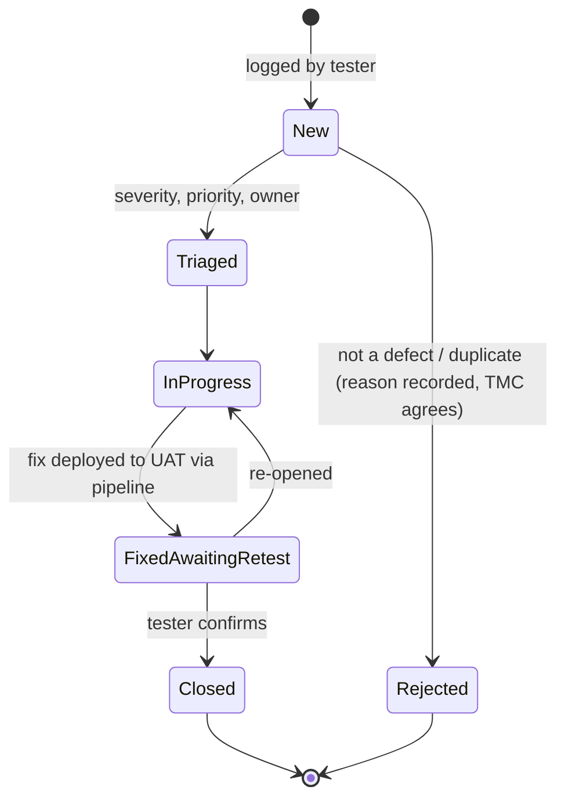

# Test Plan

| Document ID | Version | Status | RTM references |
|---|---|---|---|
| TMC-WEB-TST-01 | 0.1 | Submitted for TMC approval (SOW §4.14); approach presented at M1, detailed plan approved before M3 | R-4.14-1 to R-4.14-6, R-7.1-1, R-4.9-\*, R-4.10-6, R-4.11-3/4, R-4.8-5/7, R-4.15-8 |

## 1. Purpose and approval

SOW §4.14: "The Vendor shall prepare a test plan for TMC's approval and shall carry out, at a minimum:
functional and integration testing of all templates, interfaces, and CMS workflows; cross-browser and
cross-device testing in accordance with Section 4.9; performance and load testing against the thresholds
agreed with TMC; security testing, including VAPT, in accordance with Section 4.8; support to TMC during
User Acceptance Testing, including defect logging, tracking, and closure, with a defect closure report
submitted before each Go-Live."

This plan defines the scope, levels, environments, entry and exit criteria, defect classification, the
UAT process, the Go-Live acceptance per website and the reports produced. Tests are automated wherever
possible and run in CI on every change, so the evidence for each Go-Live is reproducible.

**Status markers.** *In place* = implemented in this repository and running in CI; *W1–W7* = delivered by
the named work stream (tool and report names verified at integration).

## 2. References

- SOW §4.3–§4.14, §5, §7.1 and the [Requirements Traceability Matrix](../requirements/RTM.md)
- [System Architecture](../architecture/system-architecture.md), [Security Architecture](../architecture/security-architecture.md)
- [Observation Remediation Procedure](../operations/security-observation-remediation.md)
- [Content Migration Coordination](../operations/content-migration-coordination.md)
- Standards: WCAG 2.2 Level AA; GIGW 3.0; OWASP Top 10 (2021); W3C HTML and CSS specifications

## 3. Scope

### 3.1 In scope

| Test item | Examples |
|---|---|
| Six websites in English and Hindi | Home, section pages, policy pages, sitemap, 404, search |
| Page templates and components (Annexures A/B) | Every template type and component of the approved design system |
| Content types | Tenders & EOIs, events (list, calendar, `.ics`), careers, departments, doctors (filter), news and notices |
| CMS workflows | Roles and permissions, draft → review → return/approve → publish/schedule, automatic expiry, revisions, translations |
| Audit trail | Every administrative event recorded; tamper detection; export |
| Integrations | Application gateway and front ends (W4), payment hand-off (W4), search with suggestions and documents (W1), maps and social (W4), analytics (W3) |
| Non-functional | Accessibility, responsiveness, browser compatibility, performance and load, security, backup/restore and DR, HTML validity, links and orphans |
| Content migration | Completeness, rendering, IA placement, redirects |

### 3.2 Out of scope

- Business logic and back ends of TMC-developed applications (SOW §4.4); only the front end and the
  integration through approved endpoints are tested.
- Accuracy of content supplied by TMC (SOW §4.11).
- TMC-owned infrastructure outside the website zone (tested by TMC; segregation evidence is in scope).

## 4. Test levels and types

| # | Level / type | What | Tool | When | Status |
|---|---|---|---|---|---|
| L1 | Static checks | PHP 8.3 syntax of every file, `theme.json`, JavaScript syntax, shell scripts, compose files | `scripts/lint.sh`, `docker compose config` | Every push (CI job *Lint*) | In place |
| L2 | Integration tests (CMS) | Permissions per role through the REST API, unit-site isolation, review queue, return with note, resubmission, publishing, Hindi translation links and URLs, audit records and tamper detection (`workflow-test.php`, 20 checks); content types and translation, migration, menus, lifecycle (open/closed, upcoming/past), current and archive listings, notice expiry, the expiry job and its audit records, re-opening, doctor filter, Content Editor permissions on tenders (`content-test.php`, 23 checks); feature suites of W1–W7 | `scripts/run-tests.sh` (WP-CLI against a freshly built network) | Every push (CI job *Integration test*) | In place; extended by each work stream |
| L3 | System smoke test | Every site in both languages, key pages, listings (current and archive), event calendar and `.ics` download, doctor filter, 404, static assets, `xmlrpc.php` blocked, no PHP errors in any page | `scripts/smoke-test.sh` + `scripts/smoke.d/*.sh` | Every push; after every deployment | In place |
| L4 | End-to-end, cross-browser and cross-device | User journeys per template; Chromium, Firefox, WebKit; mobile, tablet, desktop breakpoints | Playwright (W6) | Every push to `main`; before each Go-Live | W6 |
| L5 | Accessibility | Automated scan of every template (both languages) + manual checks (keyboard, screen reader NVDA/TalkBack, zoom 200 %, contrast, GIGW checklist) | axe-core (W6) + manual checklist | Every release; manual before each Go-Live | W6 |
| L6 | Performance | Per template, desktop and mobile | Lighthouse CI (W6) | Every release | W6 |
| L7 | Load and stress | Peak concurrent users agreed with TMC; stress to failure point | k6 or equivalent (W6/W7) | Before each Go-Live; annually | W6/W7 |
| L8 | Security | Secret scan, image and dependency scan, DAST baseline (every release); internal pre-assessment; **VAPT by a CERT-In empanelled agency** before each Go-Live; segregation tests S-1 to S-6 | CI security gate (W2); agency tools | Every release; before Go-Live; annually | W2 / agency |
| L9 | Links, orphans, HTML validity | Crawl of every site; broken links; pages not reachable from navigation/sitemap; W3C validation | Crawler + validator (W6) | Every release; before Go-Live (clean report) | W6 |
| L10 | Migration verification | Inventory vs imported items; rendering; placement; redirects for old URLs | Import reports (W3), verification report (W6) | Each migration run | W3/W6 |
| L11 | Backup, restore and DR | Restore of the latest backup; timed DR drill (RPO 15 min, RTO 1 h) | Scripts and drill record (W7) | Before Go-Live; quarterly | W7 |
| L12 | User acceptance testing | TMC testers execute UAT scripts per role | UAT on the UAT environment | Before each Go-Live (§8) | Process in this plan |

Traceability: every requirement in the [RTM](../requirements/RTM.md) names its verification; the test
report of each release lists the suites run and their results.

## 5. Test environments and data

| Environment | Used for | Data | Accounts |
|---|---|---|---|
| Development | Developer testing | Seeded sample data | Local |
| CI (GitHub-hosted, rebuilt per run) | L1–L3 on every push; L4–L6, L8–L9 per work stream | Seeded sample data only | Demo accounts created by `scripts/create-demo-users.sh` (one per role) |
| UAT | L4–L7, L9–L12, VAPT (unless TMC directs Production-equivalent) | Sample data + TMC test and migrated content | Training/UAT accounts per tester and role |
| Production | Post-deployment smoke test; post-Go-Live link scan; annual VAPT as agreed | Live | Named accounts only |
| DR | L11 drills | Restored backups | As Production |

Sample items created by provisioning carry `_tmc_sample = 1` and are titled "Sample…"; they are removed
before Go-Live ([Installation Guide §7](../operations/installation-deployment.md#7-pre-go-live-content-clean-up)).
No real patient data is ever used in any test.

## 6. Entry and exit criteria

### 6.1 Per level

| Level | Entry | Exit |
|---|---|---|
| L1–L3 (CI) | Change pushed | All checks pass; a failing check blocks merge and deployment |
| L4–L6, L9 | Release candidate deployed to UAT | No failures of Severity 1–2; Severity 3 only with an agreed fix date |
| L7 | Performance thresholds and peak load agreed with TMC | Thresholds met at the agreed load |
| L8 VAPT | Internal pre-assessment done, no known High/Critical open; scope letter agreed with the agency | All observations closed and re-tested (SOW §7.1) |
| L10 | Content package received and inventory complete | Every approved item imported and verified; redirects in place |
| L11 | Backup schedule running | Restore successful; RPO ≤ 15 min and RTO ≤ 60 min achieved |
| L12 UAT | Entry criteria of §8.2 met | Exit criteria of §8.4 met; UAT sign-off by TMC |

### 6.2 Proposed performance and load thresholds

SOW §4.10 and §4.7 refer to thresholds "agreed with TMC", which the EOI does not yet state (EOI query
Q-07). Until TMC decides, the following are proposed, measured per template type on the UAT build:

| Measure | Desktop | Mobile (simulated mid-range device, 4G) |
|---|---|---|
| Lighthouse Performance score | ≥ 90 | ≥ 85 |
| Lighthouse Accessibility score | 100 | 100 |
| Largest Contentful Paint (lab) | ≤ 2.5 s | ≤ 2.5 s |
| Cumulative Layout Shift | ≤ 0.1 | ≤ 0.1 |
| Total Blocking Time (lab proxy for INP) | ≤ 200 ms | ≤ 300 ms |
| Load test at the agreed peak concurrency | 95th percentile response time ≤ 2 s for pages; error rate < 1 % | — |

## 7. Defect classification

### 7.1 Severity (impact)

| Severity | Definition | Examples |
|---|---|---|
| **S1 Critical** | A website, the CMS or a core workflow is unavailable or unsafe; security vulnerability rated High/Critical; data loss; accessibility blocker preventing a user group from completing a key task | Site down; Content Editor can publish without review; XSS in a template; audit log not recording |
| **S2 High** | A major function fails for many users without workaround; WCAG 2.2 AA failure on a key template | Tender archive shows open tenders; search returns nothing; keyboard trap in the menu |
| **S3 Medium** | A function fails with a workaround, or one template/browser is affected; design deviation visible to users | Calendar layout broken on one browser; wrong spacing versus Figma |
| **S4 Low** | Cosmetic or textual issue with no functional impact | Misaligned icon; label typo |

### 7.2 Priority (order of fixing)

Priority P1–P4 is set by TMC's test lead with the Vendor and normally follows severity; TMC may raise the
priority of any defect. The same P1–P4 scale is used for support incidents after Go-Live
([Incident and Support Model §1.2](../operations/incident-support-model.md#12-priority-definitions)).

### 7.3 Go-Live rule

A website is not proposed for Go-Live with any **open S1 or S2 defect**. Open S3/S4 defects are allowed
only if listed in the defect closure report with TMC IT's written agreement and a fix date.

## 8. User acceptance testing (UAT)

### 8.1 Organisation

| Role | Who | Responsibility |
|---|---|---|
| UAT lead | TMC IT nodal officer | Approves UAT scripts, schedules testers, signs off |
| Testers | TMC IT, TMC-level and unit-level editors and reviewers | Execute scripts, log defects |
| UAT coordinator | Vendor QA / Testing Engineer (SOW §10) | Prepares scripts and data, supports testers, triages defects, reports daily |
| Fix team | Vendor developers | Fix defects; releases through the pipeline |

### 8.2 Entry criteria

- The release is deployed to UAT by the pipeline, CI green (L1–L3), and the automated L4–L6, L8, L9
  results of the release are available.
- UAT scripts approved by TMC; tester accounts per role created; test data present.
- Known issues list shared with testers.

### 8.3 Execution

1. UAT scripts are organised by role and journey (visitor journeys per template and language;
   Content Editor; Reviewer / Publisher; Site Administrator; Super Admin), each step with an expected
   result.
2. Testers log every deviation as a **Defect** in the tracker using the defect form
   (`.github/ISSUE_TEMPLATE/defect.yml`): site, URL, steps, expected/actual, browser/device,
   severity proposed, screenshots. No personal data in tickets.
3. The UAT coordinator triages daily (severity, priority, duplicate, owner) and publishes a daily status
   (executed / passed / failed / blocked; open defects by severity).
4. Fixes reach UAT only through the pipeline; the tester re-tests and closes, or re-opens.
5. Regression: CI runs the full automated suite on every fix; a final regression cycle of the UAT scripts
   precedes sign-off.

### 8.4 Exit criteria and sign-off

- 100 % of UAT scripts executed; ≥ 95 % passed and every failure linked to a defect.
- No open S1/S2 defect (§7.3).
- Defect closure report produced (§10.3) and accepted.
- UAT sign-off form signed by the UAT lead:

| Website(s) | Release (tag) | Scripts executed / passed | Open defects (S3/S4 with agreed dates) | Decision | Signed (TMC IT) | Date |
|---|---|---|---|---|---|---|
| | | | | Accepted / Accepted with conditions / Not accepted | | |

## 9. Go-Live acceptance per website (SOW §7.1)

For each website, before the Go-Live milestone payment, TMC IT verifies the criteria below. The evidence
pack is generated from the CI reports of the release proposed for Go-Live; the automated per-site
acceptance report is produced by W6 (verify at integration).

| # | SOW §7.1 criterion | Evidence | Produced by |
|---|---|---|---|
| 1 | Full conformance with the approved design system and IA, no unapproved variants | Visual comparison against Annexure C per template; design deviation register with TMC approvals only | W6 visual regression; [Design Deviation Register](../governance/design-deviation-register.md) |
| 2 | Zero broken links and no orphaned pages (automated scan) | Link and orphan report of the site: 0 / 0 | W6 crawler |
| 3 | WCAG 2.2 Level AA | Automated scan of every template: 0 violations; manual checklist signed | W6 + manual (L5) |
| 4 | Responsive across breakpoints; current major browsers | End-to-end results on Chromium, Firefox, WebKit at mobile/tablet/desktop | W6 (L4) |
| 5 | Performance thresholds met for every template in use | Lighthouse report per template, desktop and mobile | W6 (L6) |
| 6 | VAPT completed and all observations closed; segregation evidence accepted | VAPT report + closure report; segregation tests S-1 to S-6 | Agency; [Observation Remediation](../operations/security-observation-remediation.md); [Security Architecture §3.1](../architecture/security-architecture.md#31-segregation-validation-test-performed-at-m2-and-before-each-go-live) |
| 7 | Safe-to-Host obtained; STQC obtained or under process as applicable | Certificates / application acknowledgement | Vendor (certifying bodies) |
| 8 | Content migration completed and confirmed by TMC and the unit | Signed post-migration confirmation | [Content Migration Coordination §6](../operations/content-migration-coordination.md#6-post-migration-confirmation-one-per-website) |
| 9 | Documentation applicable to the milestone delivered | Documentation list with versions | This `docs/` set, built by `scripts/docs/build-docs.sh` |
| — | Additionally (this project) | UAT sign-off (§8.4); defect closure report (§10.3); sample content removed; demo accounts removed; security architecture re-validated | UAT lead; Vendor |

## 10. Defect management

### 10.1 Tracker and forms

Defects, change requests and support incidents are logged in the project's issue tracker (GitHub Issues
of the TMC-owned repository, or TMC's service desk if TMC prefers) using the forms in
`.github/ISSUE_TEMPLATE/`:

| Form | Label applied | Used for |
|---|---|---|
| `defect.yml` | `defect` | Deviations found in testing and UAT |
| `change-request.yml` | `change-request` | Proposed changes to agreed scope ([Change Request Procedure](../governance/change-request-procedure.md)) |
| `support-incident.yml` | `incident` | Incidents and service requests after Go-Live ([Incident and Support Model](../operations/incident-support-model.md)) |

Classification labels (created once in the tracker): `severity:S1` … `severity:S4`,
`priority:P1` … `priority:P4`, `site:tmc`, `site:tmh`, `site:hbchrcv`, `site:mpmmcc`, `site:hbchrcmzp`,
`site:hbchpunjab`, `site:all`, `phase:sit`, `phase:uat`, `phase:production`, and `status:fixed-awaiting-retest`.

### 10.2 Lifecycle



A defect is closed only by the tester who logged it or by the UAT lead, never by the developer who fixed
it. Every fix references the defect number in its commit or pull request.

### 10.3 Defect closure report

Produced before each Go-Live (SOW §4.14) from the tracker:

```bash
# all UAT defects of the TMH Go-Live, with a Go-Live gate (exit code 2 if any S1/S2 is open)
scripts/reports/defect-closure-report.sh --label defect --label phase:uat --site tmh --gate --out reports/defect-closure-tmh
```

The script (requires the GitHub CLI `gh`, authenticated with read access to the repository) writes
`<out>.md` and `<out>.csv`: totals by severity and status, open S1/S2 defects (must be none), open S3/S4
defects with owners, defects closed in the period with time to close, and the full list. The Markdown
report is signed by the Vendor QA engineer and accepted by TMC IT.

## 11. Test deliverables and reports (SOW §4.15, §8.1)

| Report | Frequency | Source |
|---|---|---|
| Test plan (this document) and UAT scripts | M1 (approach), before M3 (detailed) | This repository |
| CI run report (lint, suites, smoke) | Every push | GitHub Actions run summary and logs |
| Accessibility, cross-browser, performance, link/orphan, HTML validity reports | Every release; Go-Live evidence | W6 CI artefacts |
| Security gate report; pre-VAPT readiness report | Every release; before VAPT | W2 CI artefacts |
| VAPT report and closure report; Safe-to-Host; STQC | Before Go-Live; M6; annually | Agency / certifying body |
| Load test report | Before Go-Live | W6/W7 |
| DR drill record | Before Go-Live; quarterly | W7, [Backup and Restoration §6](../operations/backup-restore.md#6-disaster-recovery-drill-record) |
| Migration verification and redirect reports | Each migration | W3/W6 |
| UAT status and sign-off; defect closure report | Daily during UAT; each Go-Live | §8, §10.3 |

Generated reports are stored with the release, not committed to the repository.

## 12. Schedule (against SOW §7 milestones)

| Milestone | Testing activities |
|---|---|
| M1 (T+0) | Test plan approach agreed; tracker and forms set up |
| M2 (T+30) | Environments verified (smoke on Dev/CI/UAT; Production/DR build test); security architecture segregation tests S-1..S-6 on the provisioned zones |
| M3 (T+60) | Detailed test plan and UAT scripts approved; template and workflow tests green; demonstration to TMC IT |
| M4 (T+120) | Full L1–L12 for TMC + pilot unit; VAPT and closure; UAT sign-off; defect closure report; Go-Live acceptance |
| M5 (T+180) | Same for the remaining units (reduced functional scope as they reuse the platform; full link, accessibility, performance and migration checks per site) |
| M6 (T+210) | Final VAPT report; STQC and Safe-to-Host evidence; handover demonstration tests |

## 13. Risks and assumptions

| # | Risk / assumption | Mitigation |
|---|---|---|
| 1 | Performance thresholds and peak load not yet defined (Q-07) | Proposed thresholds (§6.2) measured from the start; confirmed at M2 |
| 2 | Annexures A–C arrive late | Tests are template-driven; visual baselines captured when designs arrive |
| 3 | TMC application APIs not available for integration testing | Contract-based mock endpoints in UAT (W4); live test once TMC provides endpoints |
| 4 | Tester availability at units during UAT | UAT schedule agreed with unit coordinators at M3; online UAT sessions |
| 5 | VAPT agency lead time | Agency engaged at M3; internal pre-assessment each release reduces findings |

## 14. Approval

| | Prepared by (Vendor QA / Testing Engineer) | Reviewed by (Vendor Project Lead) | Approved by (TMC IT) |
|---|---|---|---|
| Name | [BIDDER TO FILL] | [BIDDER TO FILL] | [TMC TO FILL] |
| Date | | | |
| Signature | | | |
